# 📚 EduBench

**A research workspace that builds prerequisite-relationship questions from textbooks and benchmarks AI models on them.**

[](https://opensource.org/licenses/MIT) [](https://www.typescriptlang.org/) [](https://nextjs.org/) [](https://react.dev/) [](https://www.postgresql.org/) [](https://www.docker.com/)

**English** | [한국어](README.ko.md)

[](https://ai.google.dev)

---

## 💭 Developer's Note

> *"Can a model explain what a student has to understand first?"*

<!-- TODO: 개발 동기 -->

---

## ✨ Features

### 📄 Textbook Ingestion
- PDF pages are rendered with `pdftoppm` and sent page by page to Upstage Document Parse
- The returned HTML is split into chunks by heading (`h1`/`h2`) and paragraph, and the table of contents is read from unit opener pages
- Chunks are embedded with Gemini (`gemini-embedding-2`, 3072 dimensions by default) and stored in PostgreSQL with pgvector
- Progress of each upload is streamed to the page as a live event log

### 🧪 Document Lab
- Parses a single PDF, PNG, JPEG or WebP file without saving it
- Shows the original page, the converted HTML and the raw response side by side, page by page

### ✏️ Prerequisite Question Generation
- For each question, Gemini first designs a search direction, then the matching chunks are retrieved by vector search
- Gemini returns a structured JSON question with a blueprint: target concept, prerequisite concepts, directed relations, reasoning steps and failure signals
- Every cited chunk ID is checked against the retrieved evidence; invalid JSON goes through one structured repair step
- Batches run sequentially or in parallel and can be resumed from the unfinished items

### ✅ Review and Datasets
- Reviewers approve, edit and approve, hold, reopen or delete each question next to its textbook evidence
- Approved questions are grouped into editable question sets
- Publishing a set freezes it as an immutable dataset version with a SHA-256 content hash

### 🏁 Benchmark Runs
- A run is the matrix of question × model × retrieval condition (none, simple vector RAG, Pike-inspired snapshot)
- Model IDs and generation parameters are pinned from a versioned research profile (Gemini, OpenAI, Upstage Solar, K-EXAONE; Claude and Mi:dm adapters are included)
- Runs can be paused, stopped, resumed, cancelled and retried; provider rate limits put only that provider on a cooldown
- A Gemini judge scores each response blindly on 7 profile metrics plus 6 prerequisite metrics, and every judge call is stored for audit

### 📊 Results and Monitoring
- Result analytics compare models by retrieval condition, metric and question purpose, with a heatmap
- Results export as JSON, a PDF report and a CSV evidence table
- The Research Control Room shows database, worker, queue and pipeline state over Server-Sent Events

### 🔑 Accounts and API Keys
- Username/password accounts (bcrypt hash, server-side session in an httpOnly cookie)
- Provider API keys are entered in the browser and kept only in localStorage
- Keys are sent in a request header when parsing, generation or a run starts; the server keeps them in memory for that job and never writes them to the database or logs

---

## 🚀 Getting Started

### Prerequisites
- [Docker](https://docs.docker.com/get-docker/) with Docker Compose
- (Optional) API keys for the features that call AI providers:
  - [Google Gemini](https://aistudio.google.com/apikey): embedding, question generation, judge scoring, benchmark model
  - [Upstage](https://console.upstage.ai/api-keys): PDF parsing (Document Parse), benchmark model (Solar)
  - [OpenAI](https://platform.openai.com/api-keys), [FriendliAI](https://friendli.ai/suite) (K-EXAONE), [Anthropic](https://console.anthropic.com/settings/keys): benchmark models

### Run

```bash
git clone https://github.com/Nodi-Laboratory/EduBench.git
cd EduBench
cp .env.example .env
docker compose up
```

Open http://localhost:63000 (change `WEB_PORT` in `.env` if the port is in use).

On first start the container applies the database migrations and seeds a demo account plus synthetic demo data: two made-up textbooks, generated and reviewed questions, a published dataset and a completed benchmark run. The demo data is produced by the real pipeline with local stand-ins for the AI APIs, so its scores are not real model results.

### Demo Account

| Username | Password |
|----------|----------|
| `demo` | `demo1234` |

### API Keys
Without keys you can sign in and browse every screen with the demo data. PDF upload, Document Lab parsing, question generation and new benchmark runs stay disabled and show which key is missing.

1. Open **시스템 설정** (Settings) → **API 키**
2. Paste a key next to the provider and click **저장** (Save)
3. The key is stored only in your browser's localStorage and sent with the requests that start provider work

The server keeps keys in memory only. After a restart, a running benchmark pauses itself; resuming it from the run page sends the keys again. Set `MOCK_PROVIDERS=true` in `.env` to run every feature with placeholder responses and no keys.

---

## 🛠️ Tech Stack

| Category | Technology |
|----------|-----------|
| **Framework** | Next.js 16 (App Router), React 19, TypeScript 5.9 |
| **Charts / Icons** | Recharts 3, lucide-react |
| **Validation** | Zod 4 |
| **Document processing** | poppler-utils (`pdftoppm`), cheerio, @react-pdf/renderer (PDF report) |
| **AI** | Google Gemini API, Upstage Document Parse / Solar, OpenAI Responses API, FriendliAI (K-EXAONE), Anthropic Messages API |
| **Database** | PostgreSQL 17 with pgvector, `pg`, SQL migrations |
| **Auth** | bcryptjs, server-side sessions (httpOnly cookie) |
| **Testing** | Vitest, Testing Library, Playwright |
| **Infra** | Docker Compose |

---

## 📁 Project Structure

```
EduBench/
├── 📂 src/
│   ├── 📂 app/                    # Pages and API routes (App Router)
│   │   ├── 📂 api/                # sources, generation, questions, datasets, runs, results, settings, auth
│   │   ├── 📂 login/ 📂 signup/   # Sign in / sign up pages
│   │   └── ...                    # dashboard, document-lab, sources, generation, review, datasets, runs, results, settings
│   ├── 📂 components/             # Workspace UI per screen
│   ├── 📂 domain/                 # Chunking, TOC, prompts, scoring rules, research profiles
│   ├── 📂 hooks/                  # Live event streams, browser API key store
│   ├── 📂 server/
│   │   ├── 📂 auth/               # Password hashing and sessions
│   │   ├── 📂 documents/          # PDF rendering, Document Parse, chunk/embed pipeline
│   │   ├── 📂 questions/          # Direction, retrieval and question generation
│   │   ├── 📂 runs/               # Run matrix, execution, retrieval conditions
│   │   ├── 📂 scoring/            # Judge calls and score persistence
│   │   ├── 📂 providers/          # Provider adapters and in-memory API key scopes
│   │   └── 📂 jobs/               # Lease-based job queue
│   ├── proxy.ts                   # Session check for every page and API route
│   ├── instrumentation.ts         # Starts the background worker inside the web server
│   └── worker.ts                  # Job, benchmark and scoring loops
├── 📂 db/migrations/              # SQL migrations (applied on start)
├── 📂 scripts/
│   ├── seed.ts                    # Runtime configuration (provider configs, score profile)
│   ├── seed-demo.ts               # Demo account and synthetic demo data
│   ├── 📂 demo-seed/              # Synthetic textbooks, question bank, local API stand-ins
│   └── 📂 capture-screenshots/    # Playwright script for README screenshots
├── 📂 tests/                      # unit and integration tests
├── 📂 image/                      # Screenshots
├── Dockerfile                     # Multi-stage build (deps → build → runtime with poppler)
├── docker-compose.yml             # db (pgvector), web
└── .env.example
```

---

## 💡 How to Use

1. **Sign in**: Use the demo account or create an account on the sign-up page
2. **Add API keys**: Enter the keys you need in **시스템 설정** → **API 키**
3. **Upload a textbook**: In **교과서 자료 관리**, upload a PDF with its subject and grade and follow the live processing log
4. **Generate questions**: In **질문 생성**, pick textbooks or units, purpose, format, difficulty and count, then start a batch
5. **Review**: In **질문 검수**, check each question against its evidence and approve it into a question set
6. **Publish a dataset**: In **데이터셋 관리**, publish the question set as an immutable version
7. **Run a benchmark**: In **벤치마크 실행**, choose the dataset, models and retrieval conditions, create the run and start it from its detail page
8. **Analyze results**: In **결과 분석**, compare scores and export JSON, PDF or CSV

---

## 👥 Team

| Name | Role |
|------|------|
| <!-- TODO: 팀원 이름 --> | <!-- TODO: 역할 --> |

---

## 🎨 Screenshots

<p align="center">
  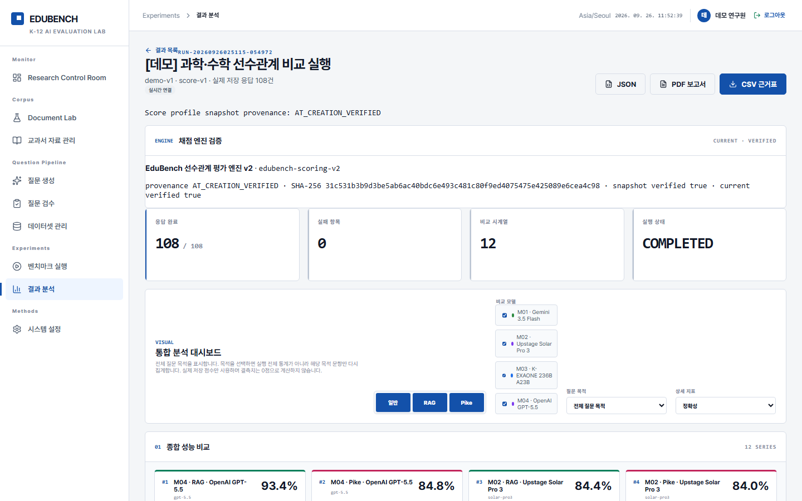
</p>

<table>
  <tr>
    <td align="center">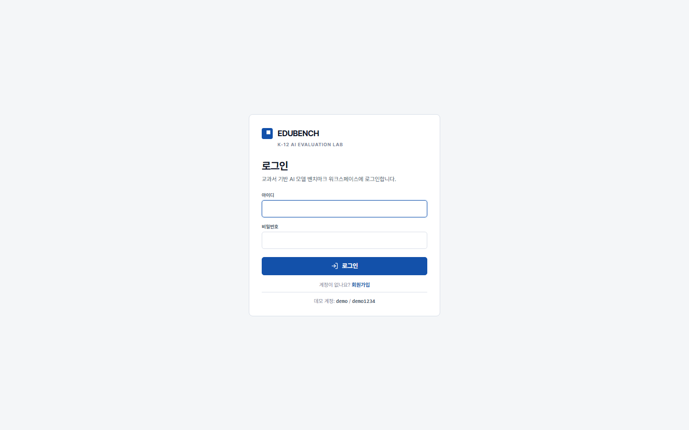<br><sub>Sign in</sub></td>
    <td align="center">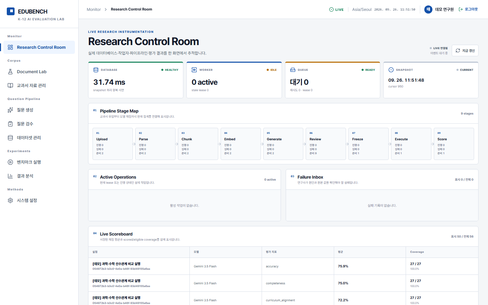<br><sub>Research Control Room</sub></td>
  </tr>
  <tr>
    <td align="center">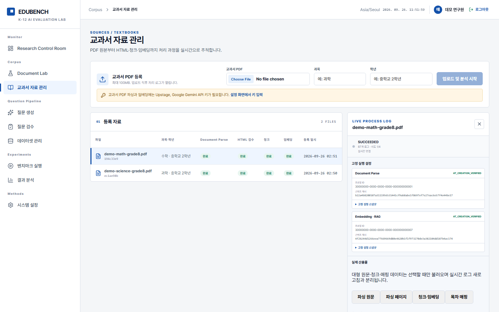<br><sub>Textbook sources and processing log</sub></td>
    <td align="center">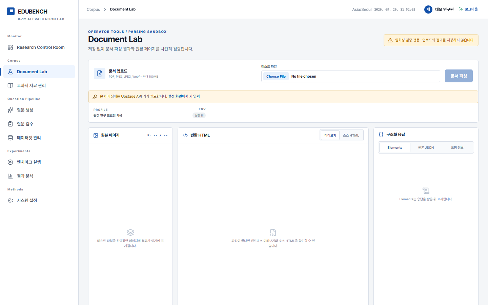<br><sub>Document Lab (API key notice)</sub></td>
  </tr>
  <tr>
    <td align="center">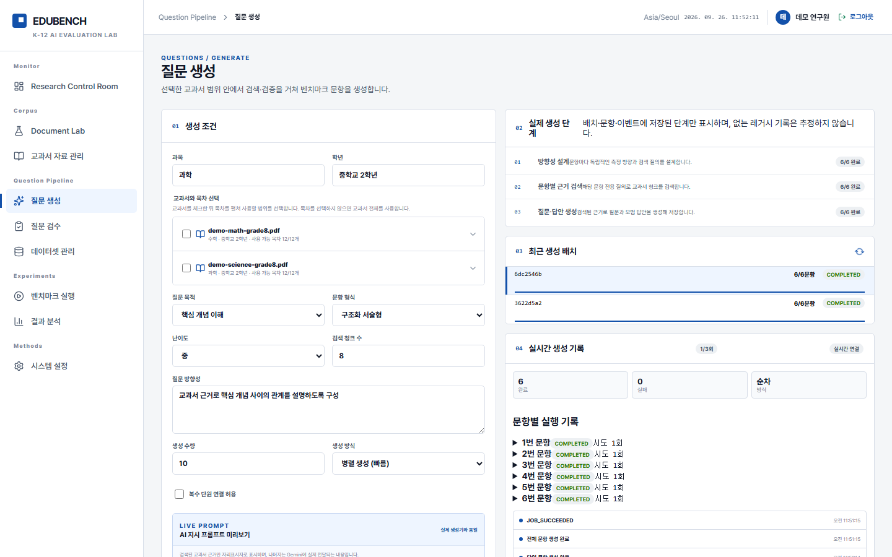<br><sub>Question generation</sub></td>
    <td align="center">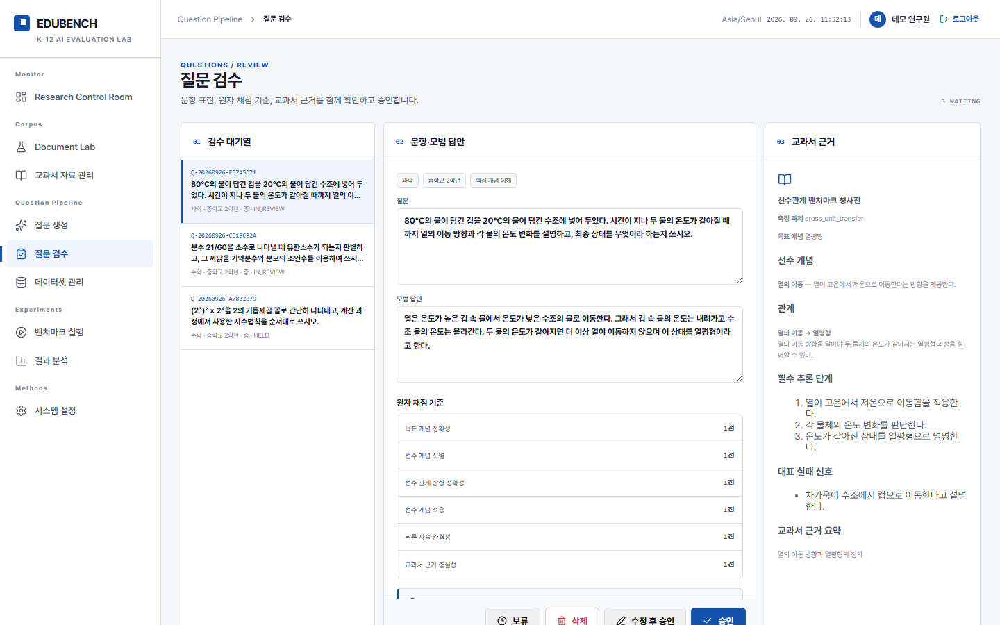<br><sub>Question review with blueprint</sub></td>
  </tr>
  <tr>
    <td align="center">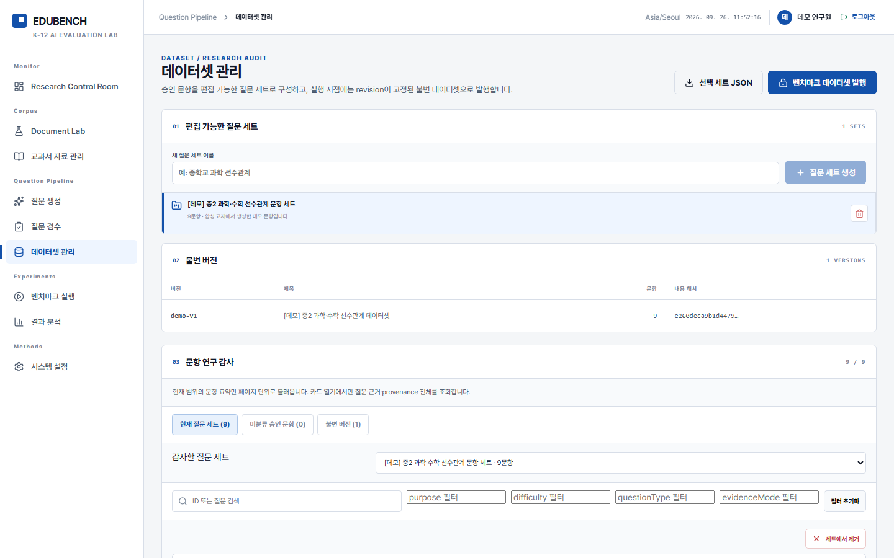<br><sub>Question sets and dataset versions</sub></td>
    <td align="center">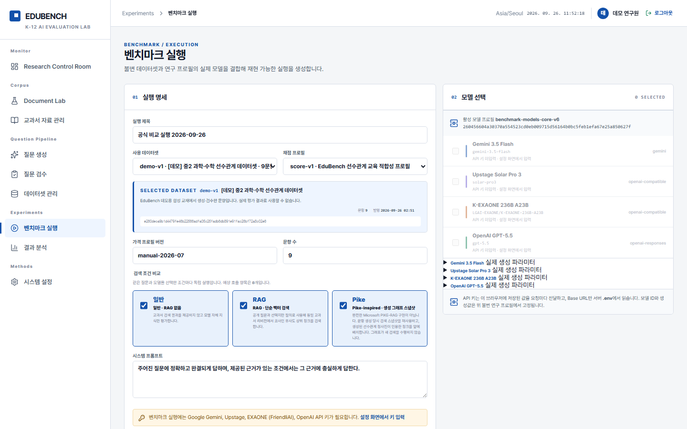<br><sub>Benchmark run setup</sub></td>
  </tr>
  <tr>
    <td align="center">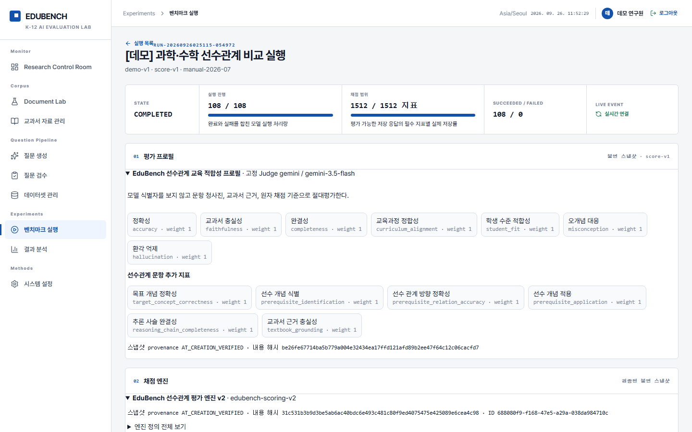<br><sub>Run detail</sub></td>
    <td align="center">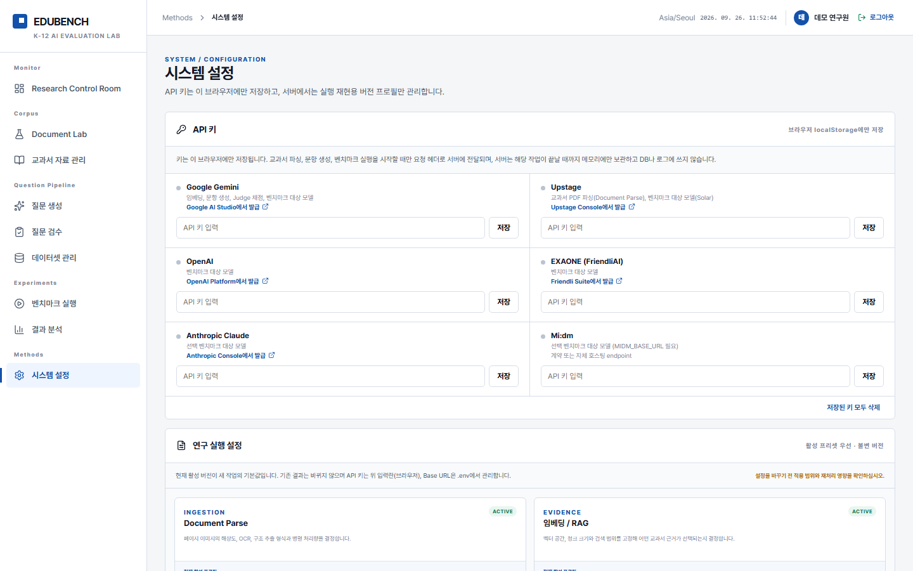<br><sub>API key settings</sub></td>
  </tr>
</table>

---

## 📝 License

MIT License. See [LICENSE](LICENSE) for details.

| 👤 Developer | ✉️ Email |
|:---:|:---:|
| Zanviq | zanviq.dev@gmail.com |
