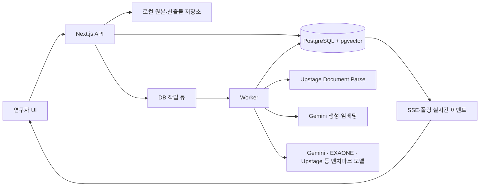
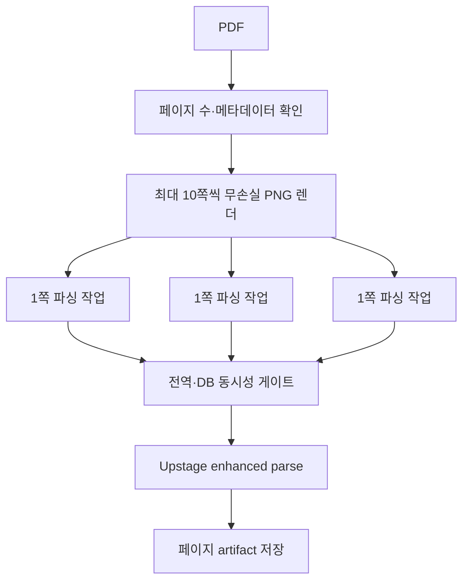

# EduBench 시스템 아키텍처와 연구 방법론

> 국내 교과서 기반 선수관계 벤치마크의 구현, PIKE-RAG·K12-KGraph 참조 범위, 재현성 및 한계

| 항목 | 내용 |
|---|---|
| 문서 상태 | 2026-07-27 `main` 반영 대상 |
| 분석 대상 | EduBench 현재 소스, DB migration, 작업 워커, 연구 UI |
| 외부 방법론 | Microsoft PIKE-RAG, K12-KGraph/K12-Bench |
| 외부 코드·데이터 포함 여부 | 없음. 논문과 공식 저장소의 공개 방법론만 비교·참조 |
| 핵심 주장 | EduBench는 두 시스템의 완전한 재현이 아니라, 제한된 한국 교과서 환경에 맞춰 “문항별 검색 계획”, “교과 구조 범위”, “선수관계 과제”, “근거 감사” 원리를 선택적으로 적용한 독립 구현이다. |

## 초록

EduBench는 국내 교과서에서 추출한 근거를 이용해 대규모 언어 모델이 목표 개념과 그 선수 개념의 방향, 적용 관계, 추론 사슬을 얼마나 정확하게 다루는지 비교하기 위한 로컬 연구 운영 시스템이다. 일반적인 질의응답 데모와 달리, 원문 파싱부터 문항 생성, 사람 검수, 데이터셋 발행, 다중 모델 실행, 자동 채점, 결과 분석까지의 입력·출력·설정·오류를 재현 가능한 기록으로 남기는 데 목적이 있다.

현재 구현은 PDF를 페이지 단위 무손실 이미지로 렌더링하고 Upstage Document Parse로 병렬 파싱한 뒤, HTML 구조 기반 청크와 Gemini 임베딩을 생성한다. 교과서 앞부분에서 추출한 목차를 청크와 연결하고, 연구자가 선택한 교과서 revision과 목차 항목만 검색 후보로 제한한다. 질문은 일괄 검색 결과를 재사용하지 않는다. 문항마다 별도의 Gemini 호출로 질문 방향과 검색 문장을 만들고, 그 문장을 별도로 임베딩해 pgvector 코사인 검색을 수행한 다음, 검색 근거만 사용해 문항·정답·루브릭·선수관계 설계를 생성한다. 생성 결과는 사람이 검수하여 편집 가능한 질문 세트에 배정하고, 실제 벤치마크에는 해당 세트에서 발행한 내용 해시 고정 데이터셋만 사용한다.

PIKE-RAG로부터는 복잡한 과제를 바로 답하지 않고 필요한 지식을 먼저 계획하고 검색한다는 지식 중심 추론 원리를 참고했다. K12-KGraph/K12-Bench로부터는 교과 구조, 선수관계 방향, 이웃 관계, 근거 위치를 분리된 평가 대상으로 다루는 방식을 참고했다. 그러나 현재 EduBench에는 PIKE-RAG의 지식 원자 이중 인덱스와 반복 검색·선택 루프, K12-KGraph의 검증된 지식 그래프와 결정론적 그래프 문항 생성은 구현되어 있지 않다. 따라서 본 문서는 참조한 원리, 실제 구현, 향후 확장 대상을 구분해 기술하며 외부 시스템과 동일한 성능 또는 검증 수준을 주장하지 않는다.

## 1. 연구 목적과 적용 조건

### 1.1 연구 질문

EduBench가 다루는 핵심 연구 질문은 다음과 같다.

1. 모델은 교과서 범위 안에서 목표 개념의 정답을 도출하는가?
2. 목표 개념을 이해하기 위해 먼저 필요한 개념을 식별하는가?
3. 선수 개념에서 목표 개념으로 향하는 관계의 방향과 이유를 정확히 설명하는가?
4. 선수 개념을 단순히 언급하는 데 그치지 않고 실제 추론에 적용하는가?
5. 필수 중간 단계를 생략하지 않고 완결된 추론 사슬을 구성하는가?
6. 핵심 주장이 제공된 교과서 근거로 지지되는가?
7. 위 결과가 동일한 데이터셋·프로필·모델 설정에서 재현 가능하고, 실패 원인을 문항 단위로 추적할 수 있는가?

### 1.2 현실적 제약

대상 자료는 과학과 한국사를 중심으로 과목당 소수 교과서에 한정될 수 있다. 모든 개념과 관계를 교과 전문가가 반복 검증할 인력과 시간도 충분하지 않다. 그러므로 현재 시스템은 완전한 수작업 지식 그래프보다 다음 원칙을 우선한다.

- 교과서 원문과 페이지 근거를 보존한다.
- 목차 구조를 검색 범위 제약으로 사용한다.
- 생성 모델이 제안한 선수관계는 자동으로 정답으로 확정하지 않고 검수 가능한 설계 정보로 보존한다.
- 자동 채점 결과와 그 이유를 모두 노출한다.
- 설정과 입력 revision을 고정해 같은 실험을 다시 설명할 수 있게 한다.
- 실패한 일부 문항 때문에 완료된 전체 결과가 사라지지 않게 한다.

이 설계는 전문가 검증을 대체했다고 주장하지 않는다. 제한된 검수 자원을 원문·질문·관계·채점 근거가 함께 보이는 지점에 집중시키는 운영적 절충이다.

## 2. 방법론 조사

### 2.1 PIKE-RAG

PIKE-RAG는 산업 도메인의 복잡한 과제를 위해 파싱, 지식 추출·저장·검색·조직, 지식 중심 추론, 과제 분해·조정을 하나의 프레임워크로 구성한다. 자료의 실증 수준은 구분할 필요가 있다. arXiv 기술보고서는 L0–L4 전체 시스템 청사진과 다층 지식 구조를 폭넓게 제안한다. ICML 2025 동료평가 논문은 그중 L2 핵심인 `KAR³`(Knowledge-Aware dual Rewriting and Reasoning)를 multi-hop QA에서 구체화하고 평가한다. 따라서 EduBench는 전체 청사진과 ICML에서 실험된 메커니즘을 같은 수준으로 검증됐다고 서술하지 않는다.

PIKE-RAG 기술보고서는 과제를 사실 확인 중심에서 연결·추론·예측·창작 중심으로 확장되는 L1–L4 계층으로 설명한다. 같은 문장이라도 현재 지식베이스에 정답이 직접 존재하면 L1 factual, 여러 근거를 연결해야 하면 L2 linkable-reasoning이므로 난이도는 표면 문장보다 지식 상태와 요구 hop으로 정의해야 한다. ICML 논문은 이 전체 taxonomy를 제시하는 자료가 아니라, multi-hop QA를 대상으로 “어떤 지식이 더 필요한가”를 반복적으로 제안·검색·선택하는 KAR³의 L2 메커니즘을 평가한다.

공식 구현에서 특히 관련 있는 구조는 knowledge atomizing과 `ChunkAtomRetriever`다. 여기서 atom은 논리적으로 최소이며 검증된 사실 triple이 아니라, “이 청크로 답할 수 있는 질문”을 LLM이 만든 검색용 tag다. 원문 청크에서 검색에 적합한 원자 질문을 여러 개 생성해 별도 인덱스에 저장하고, 원자 질문이 가리키는 원문 청크 ID를 유지한다. 질의 시에는 원문 청크를 직접 검색하거나 원자 질문을 검색한 뒤 연결된 원문 청크로 돌아갈 수 있다. `qa_decompose` 계열 워크플로는 현재 질의와 누적 문맥을 보고 다음에 필요한 원자 질문 후보를 제안하고, 검색 후보 중 유용한 정보를 선택해 문맥에 추가하는 과정을 반복한다.

이를 단순화하면 PIKE-RAG의 반복 검색은 다음과 같이 나타낼 수 있다.

\[
C_0=\varnothing,\quad
P_t=\operatorname{Propose}(q,C_{t-1}),\quad
R_t=\operatorname{Retrieve}(P_t),\quad
s_t=\operatorname{Select}(q,C_{t-1},R_t),\quad
C_t=C_{t-1}\cup\operatorname{Chunk}(s_t)
\]

여기서 \(q\)는 원래 질문, \(C_t\)는 누적 근거, \(P_t\)는 다음에 필요한 지식 질문 후보, \(R_t\)는 검색 결과다. 충분한 근거가 모이거나 반복 상한에 도달하면 최종 답을 생성한다.

EduBench가 현재 적용한 것은 이 전체 알고리즘이 아니라 “문항을 만들기 전에 해당 문항에 필요한 검색 방향을 독립적으로 계획한다”는 원리다. 각 문항은 `directionSummary`, `targetConceptQuery`, `prerequisiteQuery`, `searchQuery`를 새로 생성하고 그 문항 전용 검색을 실행한다. 반면 원자 질문 인덱스, 반복 proposer-selector, 누적 다중 홉 검색, 학습된 decomposer는 없다. 따라서 현재 방식을 PIKE-RAG 또는 KAR³ 구현이라고 부르지 않고, PIKE에서 동기를 얻은 one-shot question-aware RAG로 기술한다.

ICML 실험은 HotpotQA, 2WikiMultiHopQA, MuSiQue의 표본과 GPT-4/Llama-3.1-70B를 사용했으며, 특히 복잡한 MuSiQue에서 개선 폭이 컸다. 그러나 반복 proposer와 selector 때문에 MuSiQue의 문항당 token 사용량은 naive RAG보다 크게 높았다. ICML component ablation은 질문형 atom, 복수 proposal, atom 기반 검색·선택을 결합한 전체 구조가 중요함을 보여 준다. 별도로 기술보고서의 hierarchical retrieval 비교에서는 atom 계층 인덱스만 naive RAG에 붙였을 때 일관된 이득이 없고 decomposition과 결합했을 때 효과가 커졌다.

또한 ICML 부록의 GPT-3.5 실험에서는 KAR³가 일부 baseline을 일관되게 앞서지 못해, 복잡한 지시 준수와 reasoning 성능에 대한 모델 의존성을 드러낸다. 이 결과들은 한국어 교과서에서의 향상을 보장하지 않으므로 EduBench에서는 현재 one-shot 방식을 대조군으로 고정하고 단계별 ablation을 해야 한다.

### 2.2 K12-KGraph와 K12-Bench

K12-KGraph는 중국 K-12 교과서에서 개념·기능·실험·문제 등의 노드와 선수관계·부분관계·근거관계 등의 엣지를 구축하고, 이를 이용해 구조적 교육 추론을 평가하는 데이터 및 벤치마크다. 공개 논문과 저장소가 설명하는 대표 과정은 다음과 같다.

1. MinerU 기반 OCR과 레이아웃 복원
2. 목차와 절 구조를 이용한 교과서 분할
3. 스키마 제약을 둔 LLM 기반 노드·관계 추출
4. 절, 책, 과목 수준의 계층 병합
5. 방향 비순환성 등 구조 검사
6. 전문가 검증
7. 그래프에서 평가 문항과 오답 후보 생성

고정한 공개 commit만으로 clean-room 재구축할 때는 재현성 공백도 있다. `merge_kg.py`는 `leads_to` 관계를 새로 생성하기보다 기존 global edge를 읽어 보존하고, 최종 global graph는 node·edge의 세부 속성과 evidence를 축약한다. 그러므로 공개 코드만으로 Locate의 선수 chapter 관계와 모든 provenance를 처음부터 동일하게 재현할 수 있다고 주장하지 않는다.

논문 revision과 실제 공개 파일은 시점이 다르다. 2026-07-23 arXiv v3은 Figure·VisualElement와 시각 관계를 추가한 9개 node/14개 relation, K12-Train 7,335개(Text 2,267 + multimodal 5,068)를 보고한다. 반면 분석한 GitHub/Hugging Face 공개 snapshot은 2026-05-06 기준이며 텍스트형 7개 node/9개 relation과 Train 2,267개를 제공한다. 공개 snapshot의 실측 규모는 10,685 nodes와 23,278 edges다.

| 항목 | 2026-05-06 공개 GitHub/HF | 2026-07-23 논문 v3 |
|---|---:|---:|
| node 유형 | 7 | 9 |
| relation 유형 | 9 | 14 |
| graph | 10,685 nodes / 23,278 edges | 텍스트 graph에 시각 node·relation 확장 보고 |
| K12-Bench | 23,640 raw lines | 23,640 문항 보고 |
| K12-Train | 2,267 text QA | 7,335 text+multimodal QA 보고 |

따라서 논문 v3의 멀티모달 확장 전체가 현재 공개 코드와 파일로 재현된다고 주장하지 않는다. 공개 저장소 기본 설정의 추출 모델도 논문이 기술한 GPT-5.2가 아니라 `gpt-4.1-mini`이며, 원본 교과서 파일은 별도로 확보해야 한다. 공개 benchmark JSONL 23,640행 중 두 행은 LaTeX escape 오류로 엄격 JSON parser에서 실패하므로 raw record 수와 즉시 사용 가능한 valid record 수를 구분해야 한다.

논문 v3의 schema는 Book, Chapter, Section, Concept, Skill, Experiment, Exercise, Figure, VisualElement를 포함하며 `prerequisites_for`, `tests_concept`, `tests_skill`, `appears_in`, `leads_to`, `verifies`, `supports_edge` 등의 관계를 사용한다. 공개 텍스트 snapshot에는 48권이 포함되지만 초등 자료는 수학에만 존재한다. “모든 과목이 초·중·고 전 학년을 포괄한다”는 해석은 부정확하다.

K12-Bench는 다음과 같은 그래프 추론 계열을 평가한다.

- Ground: Exercise가 평가하는 Concept/Skill 또는 Concept/Skill을 평가하는 Exercise 식별
- Prereq: Concept/Skill의 선수 closure 또는 직접 뒤따르는 Concept/Skill 식별
- Neighbor: `is_a`·`relates_to`로 직접 연결된 concept 식별
- Evidence: 개념을 검증하는 실험 또는 실험이 검증하는 개념 식별
- Locate: 지식 entity의 최초 등장 chapter 또는 주어진 chapter의 선수 chapter 식별

공개 벤치마크는 5개 family, 9개 subtask로 구성된다.

| family | 대표 관계 | 보고 문항 수 |
|---|---|---:|
| Ground 2종 | Exercise ↔ Concept/Skill | 3,850 |
| Prereq 2종 | 선수 closure·직접 후속 | 5,417 |
| Neighbor | 직접 분류·연관 이웃 | 4,358 |
| Evidence 2종 | Concept ↔ Experiment | 1,391 |
| Locate 2종 | 최초 등장 chapter·선수 chapter | 8,624 |
| 합계 |  | 23,640 |

문항은 그래프에서 규칙적으로 구성된 4지 다중선택형이며 정답은 1–3개다. 논문 v3이 기술한 절차에서 오답은 2-hop, 공통 상위 개념, 동일 section/chapter/book 등 구조적으로 가까운 후보를 우선하고, BGE embedding으로 순위를 매긴 뒤 character 3-gram과 LLM 교육적 filter로 후보를 제거한다. 다만 분석 기준 공개 benchmark entrypoint에는 논문 v3의 후반 두 filter 단계가 없어 공개 코드 재현 범위와 논문 절차를 구분해야 한다. 정답 위치와 정답 개수 조합은 안정적 무작위화로 균형화한다.

중요하게도 K12-Bench의 최종 평가는 RAG retrieval benchmark가 아니다. 모델에는 교과서나 graph를 주지 않고 질문과 선택지만 제공해 내재된 curriculum knowledge를 zero-shot closed-book으로 측정한다. embedding 검색은 오프라인 오답 생성에 사용된다. 따라서 K12의 Evidence task를 citation retrieval로 해석하거나 Recall@k·MRR 실험으로 설명해서는 안 된다.

평가는 전체 정답 집합이 일치하는 exact match와 문항별 label-set F1을 함께 사용한다. overall은 문항 수 가중 평균이다.

정답 집합 \(G_i\), 예측 집합 \(P_i\)에 대한 문항별 F1은 다음과 같다.

\[
\operatorname{Precision}_i=\frac{|P_i\cap G_i|}{|P_i|},\quad
\operatorname{Recall}_i=\frac{|P_i\cap G_i|}{|G_i|},\quad
F1_i=\frac{2\operatorname{Precision}_i\operatorname{Recall}_i}
{\operatorname{Precision}_i+\operatorname{Recall}_i}
\]

\[
\operatorname{MacroF1}=\frac{1}{N}\sum_{i=1}^{N}F1_i
\]

precision과 recall이 모두 0인 문항은 논문 규칙에 따라 \(F1_i=0\)으로 둔다.

논문은 과목별 3명씩 총 12명의 교육 분야 검증자가 graph node와 relation을 독립 검토하고 합의했으며 전체 Fleiss’ \(\kappa=0.84\)를 보고한다. K12-Bench는 과제·과목·학년으로 층화한 15% 표본에서 98.4%, K12-Train은 생성 방식별 10% 표본에서 96.9% fully correct를 보고한다. 즉 graph 검증과 파생 데이터 표본 검증을 구분해야 한다. 이 품질 수치 역시 현재 한국 교과서 관계의 검증 결과로 이전할 수 없다.

EduBench는 중국 교과서, K12 graph 파일, 문항 또는 loader를 포함하지 않는다. 공개 dataset의 CC BY-NC-SA 4.0 조건 때문에도 중국 자료를 상업적 한국 서비스 데이터에 직접 혼합하지 않고, 방법론만 참고해 허가된 한국 자료에서 provenance를 독립 구축하는 것이 적절하다. K12 방법론에서 참조한 것은 교과 계층을 보존하고, 선수관계의 방향·적용·근거를 독립 지표로 분해해야 한다는 평가 설계 원리다.

현재 EduBench 문항은 graph template이 아니라 선택 범위에서 검색된 국내 교과서 청크와 LLM으로 생성되고, 실제 benchmark model에는 고정 evidence packet을 제공한다. 즉 EduBench는 grounded 선수관계 QA이고 K12-Bench는 graph-derived closed-book curriculum cognition benchmark다. 두 결과를 같은 점수 축으로 혼합하거나 EduBench를 K12-Bench의 재현·번역판이라고 부를 수 없다.

### 2.3 적용 범위 비교

| 방법 | 원 연구 | EduBench 현재 상태 | 판정 |
|---|---|---|---|
| 원문 레이아웃 파싱 | 두 연구 모두 구조화 파싱을 전제로 함 | Upstage로 페이지별 HTML/Markdown 및 원응답 저장 | 구현 |
| 목차 기반 분할·범위 | K12의 교과 계층 | 앞부분 목차 추출, 청크 매핑, 선택 목차로 검색 SQL 제한 | 구현 |
| 문항별 검색 계획 | PIKE의 지식 중심 분해 | 문항별 방향 LLM과 검색 문장 생성 | 단순화 구현 |
| 원문 청크 벡터 검색 | PIKE의 검색 계층 | Gemini 임베딩·pgvector 코사인 top-k | 구현 |
| 검색 결과의 원문 연결 | PIKE atom→chunk 연결 | 검색 결과가 처음부터 원문 청크이며 ID·페이지를 보존 | 목적 유사, 구조 상이 |
| 지식 원자 이중 인덱스 | PIKE knowledge atomizing | 없음 | 미구현 |
| 반복 질문 제안·검색·선택 | PIKE `qa_decompose` | 한 번의 방향 생성과 한 번의 검색 | 미구현 |
| 검증된 교과 지식 그래프 | K12-KGraph | 없음 | 미구현 |
| 그래프 기반 결정론적 문항 | K12-Bench | 검색 근거 기반 LLM 생성 | 미구현 |
| 선수관계 평가 | K12 Prereq/Neighbor 구조 과제의 문제의식 | 관계 방향·적용·추론·근거 지표 | 목적에 맞게 변형 구현 |
| exact match | K12 평가 | 객관형·정답형 문항에 사용 | 구현 |
| 집합 macro F1 | K12 다중선택 평가 | 현재 핵심 집계에는 없음 | 향후 후보 |
| KG node/edge 전문가 전수 검증 | K12 graph 구축 과정 | 전역 KG가 없고 제한된 연구자 문항 검수만 제공 | 미구현 |

## 3. 전체 시스템 구조

EduBench는 Next.js 웹 애플리케이션, PostgreSQL/pgvector 데이터베이스, 비동기 worker, 로컬 파일 저장소, 외부 모델 API로 구성된다.



핵심 설계는 “현재 편집 가능한 상태”와 “과거 실험을 재현하는 불변 상태”를 분리하는 것이다.

- 원본 파일은 revision을 가진다.
- 파싱·임베딩·질문 생성에는 활성 연구 설정의 ID, 전체 정의, SHA-256 해시를 고정한다.
- 질문은 revision을 가진다.
- 질문 세트는 편집 가능하다.
- 발행된 데이터셋은 질문 ID와 revision을 불변 snapshot으로 보존한다.
- 실행에는 데이터셋, 모델, 프롬프트, 샘플링 파라미터, 채점·가격 프로필 snapshot이 복사된다.
- Document Parse, 질문 생성, 벤치마크 응답, judge의 요청·응답은 단계별 감사 레코드로 남는다. 임베딩은 현재 batch 이벤트와 결과 벡터·감사 통계만 남기며 raw provider invocation은 보존하지 않는다.

## 4. 교과서 수집과 파싱

### 4.1 등록과 중복 처리

교과서 업로드 시 PDF MIME, `%PDF-` magic bytes, 100MiB 제한을 확인하며 파일명만으로 동일 자료를 판별하지 않는다. 파일 bytes의 SHA-256과 UUID별 저장 경로를 사용하므로 동일 이름의 서로 다른 파일이 덮어써지지 않는다. 동일 bytes 업로드는 PostgreSQL advisory transaction lock으로 직렬화하며, 중복 판정에는 파일 hash뿐 아니라 현재 document parse 및 embedding/RAG profile hash도 포함한다. 같은 PDF라도 설정이 달라지면 기존 결과를 덮지 않고 `source_lineage_id`와 `reprocessed_from_source_file_id`를 가진 새 처리 계보를 만든다.

원본은 `storage/sources/<source UUID>/original.pdf`에 보존하고 DB에는 파일 메타데이터, 처리 상태, 선택한 설정 pin, 작업 이벤트를 기록한다. 자료 삭제는 `deleted_at`과 `DELETED` 상태를 사용하는 soft delete이며 원본 storage를 물리 삭제하지 않는다. 같은 bytes·같은 profile의 READY 자료는 새 사본이 아니라 기존 처리 결과를 반환한다.

### 4.2 PDF 페이지 스트리밍

현재 기본 연구 프로필은 PDF를 300 DPI의 무손실 PNG로 렌더링한다. 이미지가 손실 압축으로 흐려져 표·수식·각주 인식이 저하되는 것을 피하기 위한 선택이다. 렌더러는 PDF 전체를 한 번에 메모리에 올리지 않고 `pagesPerBatch` 단위로 페이지를 만든다. 기본값은 10쪽/렌더 배치다.

파싱 요청 단위는 렌더 배치와 별개다. `DOCUMENT_PARSE_PAGES_PER_TASK=1`이므로 Upstage에는 한 페이지씩 요청한다. 여러 페이지 요청을 동시에 처리하되, 연구 프로필의 요청 동시성, 애플리케이션 동시성 게이트, `UPSTAGE_DOCUMENT_PARSE_MAX_CONCURRENCY` 상한을 함께 적용한다. 기본 프로필의 요청값은 4지만 제공자 보호를 위한 기본 유효 상한은 2다.



### 4.3 Document Parse 설정

기본 설정은 다음과 같다.

- `ocr=force`
- `mode=enhanced`
- 출력 형식: HTML
- `base64_encoding=["table","figure","chart","equation"]`
- PDF 렌더링: 300 DPI, PNG, 무손실
- 페이지별 요청 재시도: 최대 8회

`base64_encoding`은 단순히 원문 이미지를 통째로 base64로 보내는 옵션이 아니다. 파서 결과 안의 표, 그림, 차트, 수식 요소를 base64 자산과 함께 반환하도록 요청하는 설정이다. 연구 설정 페이지에서 HTML/Markdown 출력, DPI, 렌더 형식, 품질, 배치 크기, 동시성, timeout을 새 프로필로 저장할 수 있다. base64 항목은 UI에 체크박스로 보이지만 현재 server schema는 표·그림·차트·수식 네 항목을 모두 요구하므로 일부만 끈 profile은 저장되지 않는다. “인코딩 대상을 자유롭게 조합할 수 있다”는 설명은 현재 구현과 맞지 않으며 추후 schema 보완이 필요하다.

### 4.4 페이지 단위 artifact

각 파싱 성공 결과는 `source_revision_page_artifacts`에 저장된다.

- 페이지 번호
- 렌더 이미지 크기와 설정
- 요청에 사용한 parser 설정 snapshot
- provider request ID
- provider 원응답
- 추출 HTML
- 추출 Markdown
- 생성 시각

이 레코드는 수정 방지 trigger의 보호를 받는다. 연구자는 자료 상세 화면에서 주소 문자열만 보는 것이 아니라 실제 페이지별 결과를 펼쳐 비교할 수 있다. Document Lab은 DB 등록 없이 단일 파일의 원본 페이지와 parser 결과를 비교하는 진단 경로다.

### 4.5 부분 실패와 재개

각 Upstage 호출은 페이지 단위이며 페이지별 재시도·실패 이벤트에는 페이지, 시도 횟수, 오류 코드와 메시지가 남는다. 그러나 현재 페이지 결과는 전체 페이지 파싱이 끝날 때까지 메모리에 모이고, 그다음 하나의 transaction에서 source revision과 page artifact로 저장된다. 따라서 페이지 호출 단위의 병렬성은 있지만 **페이지 단위 durable checkpoint는 아직 없다**. 파싱 도중 취소되거나 최종 페이지가 실패하면 다음 source retry에서 완료 페이지도 다시 파싱한다.

파싱 revision을 저장한 뒤 임베딩 단계에서 실패한 경우에도 현재 retry는 해당 revision의 청킹·임베딩부터 이어 가지 않고 전체 문서 처리를 다시 시작한다. source 작업은 cancel/retry가 가능하지만, 이를 “완료 페이지 또는 embedding batch부터 정확히 재개한다”고 표현해서는 안 된다. 페이지 및 embedding batch checkpoint는 향후 보완 대상이다.

## 5. 청킹, 목차 및 임베딩

### 5.1 의미 청킹

페이지별 추출 결과를 순서대로 결합한 뒤 HTML 구조 기반 청크를 만든다. 현재 구현은 별도 semantic chunking 모델을 호출하지 않는다. 각 `[data-page]` 안의 `p`, `li`, `table`, `[data-kind]` 요소를 블록으로 보고, 장·단원 제목을 다음 페이지로 이어 받는다. profile의 목표 크기는 실제 tokenizer가 아니라 `문자 수 ÷ 3` 휴리스틱으로 추정한다. 긴 블록은 문장 경계 또는 문자 길이로 분할한다. 청크는 다음 정보를 가진다.

- source file ID와 source revision ID
- 전체 revision 안의 순번
- 페이지 시작 위치
- 단원 또는 구조 정보
- 정규화 본문
- 임베딩
- 임베딩 연구 프로필 ID·해시·vector space ID

문단과 구조 경계를 우선하되 검색과 모델 context에 적합한 크기 제한을 적용한다. 표의 HTML 구조는 보존되지만 임베딩 입력은 정규화한 평문이다. 긴 DOM 블록이 분할되면 `content`는 나뉘어도 감사용 `html`에는 같은 원본 블록이 반복될 수 있다. 이 과정의 목표는 “원문 위치를 잃지 않는 검색 단위”를 만드는 것이며, 실제 모델 토큰 수와 추정치 사이의 오차는 현재 한계다.

### 5.2 목차 추출과 청크 정렬

파이프라인은 교과서 앞 10쪽 안에서 목차 후보를 추출한다. 추출된 항목은 제목, 계층, 페이지 단서, 순서를 가진 `source_toc_entries`로 저장된다. 이후 제목·페이지·순서 정보를 사용해 각 목차 항목과 현재 revision의 청크를 연결하며, 연결은 `source_chunk_toc_entries`에 기록한다.

목차는 표시용 메타데이터만이 아니다. 질문 생성에서 연구자가 목차 항목을 선택하면 SQL의 후보 집합 자체가 해당 항목에 매핑된 청크로 제한된다. 매핑된 청크가 없는 항목은 생성 전에 `GENERATION_TOC_SCOPE_EMPTY`로 실패시켜, 선택 범위를 무시한 전역 검색이 조용히 실행되는 것을 막는다.

### 5.3 임베딩

현재 기본 임베딩 공급자는 Gemini다. 기본 벡터 차원은 3072이며 문서와 질의에 서로 맞는 task type을 사용한다. profile의 prefix 전략이 활성화된 경우 문서와 질의에 각각 고정 prefix를 추가한다.

청크 벡터는 batch 단위로 나누고 여러 batch를 병렬 처리한다. 기본 연구 프로필은 50개 청크/배치, 동시성 3이다. 각 batch 시작·완료·실패는 이벤트로 보존한다.

임베딩 \(x\)의 저장 공간은 단순 모델명만으로 식별하지 않는다. 모델, 차원, task type, prefix 정책과 설정 해시를 포함한 `vectorSpaceId`로 검증한다. 질문 생성 시 현재 검색 프로필과 청크 생성 당시 프로필 해시가 다르면 `GENERATION_VECTOR_SPACE_MISMATCH`로 중단한다. 서로 다른 임베딩 공간의 벡터를 같은 거리 척도로 비교하는 오류를 방지하기 위해서다.

현재 DB에는 HNSW/IVFFlat 근사 최근접 인덱스가 없고 선택 source revision 범위에서 exact cosine 정렬을 수행한다. 소수 교과서에서는 단순하고 재현 가능한 선택이지만 청크 수가 크게 늘면 검색 시간이 증가한다. 또한 문서 임베딩 batch별 raw provider 응답·request ID를 저장하는 invocation 테이블은 아직 없으며, query vector는 전체 값 대신 차원·norm·SHA-256만 감사 정보에 남긴다.

## 6. 문항별 RAG 질문 생성

### 6.1 핵심 실행 단위

생성 배치에는 요청 문항 수만큼 `generation_items`가 만들어진다. 각 item은 ordinal, 상태, 시도 횟수, lease 소유자, 방향 결과, 검색 감사 정보, provider invocation, 최종 question을 독립적으로 가진다. 병렬 모드는 연구 프로필의 생성 동시성을 사용하고, 순차 모드는 동시성을 1로 강제한다.

중요한 점은 검색을 배치 전체에서 한 번만 수행하지 않는다는 것이다. 문항 \(i\)마다 아래 전체 과정이 다시 실행된다.

\[
d_i=\operatorname{DirectionLLM}(c,i)
\]

\[
v_i=\operatorname{Embed}(d_i.\text{searchQuery})
\]

\[
E_i=\operatorname{TopK}\left(
1-\operatorname{CosineDistance}(v_i,x_j)
\mid j\in S_{\text{revision}}\cap S_{\text{TOC}}
\right)
\]

\[
q_i=\operatorname{QuestionLLM}(c,d_i,E_i)
\]

여기서 \(c\)는 사용자가 선택한 목적·형식·난이도·자료 범위이고, \(S_{\text{revision}}\)은 고정한 교과서 revision 범위, \(S_{\text{TOC}}\)는 선택 목차 범위다.

### 6.2 1단계: 질문 방향 생성

방향 생성기는 다음 네 필드를 가진 구조화 JSON만 반환하도록 요청받는다.

- `directionSummary`: 이번 문항이 측정할 독립적 방향
- `targetConceptQuery`: 목표 개념 검색 표현
- `prerequisiteQuery`: 선수 개념 검색 표현
- `searchQuery`: 두 표현을 결합한 실제 벡터 검색 문장

문항 번호와 전체 조건을 매번 포함하므로 같은 배치 안에서도 각 문항이 독립적인 검색 목적을 갖는다. 응답은 JSON schema와 MIME type 제약을 사용하고, finish reason이 정상 종료가 아니거나 schema가 깨지면 방향 단계 실패로 기록한다.

### 6.3 2단계: 범위 제한 벡터 검색

`searchQuery`를 query task type으로 임베딩하고 pgvector의 cosine distance 연산자 `<=>`로 후보를 정렬한다. 유사도 표시는 다음과 같다.

\[
\operatorname{similarity}(v,x)=1-(v\mathbin{<=>}x)
\]

후보는 반드시 다음 조건을 모두 만족해야 한다.

1. 생성 배치에 고정된 source revision에 속한다.
2. 임베딩 연구 프로필 해시가 현재 생성 pin과 같다.
3. vector space ID가 같다.
4. 실 provider 모드에서는 embedding이 존재한다.
5. 목차를 선택했다면 해당 목차 항목에 매핑되어 있다.

top-k anchor 뒤에는 같은 revision에서 anchor보다 앞선 청크를 `neighborWindow`만큼 추가한다. 이는 정의나 전제가 바로 앞 문단에 있는 교과서 서술 관행을 보완하기 위한 것이다. 현재 구현은 앞선 청크만 확장하며 양방향 또는 그래프 이웃 확장은 아니다. 중복 청크는 하나로 제거하고 anchor의 semantic rank와 유사도를 함께 보존한다.

검색 감사 레코드에는 검색 문장, query vector의 모델·차원·norm·SHA-256, top-k, neighbor window, 거리 척도, 선택 revision·목차, 각 청크의 ID·페이지·순번·유사도·검색 경로가 저장된다. 실제 벡터 전체를 UI에 무의미하게 노출하는 대신 해시와 통계로 동일 입력 여부를 확인한다.

### 6.4 3단계: 근거 제한 질문 생성

생성 모델에는 검색된 청크의 ID, 페이지, 단원, 본문과 함께 조건별 상세 프롬프트를 전달한다. 결과에는 최소한 다음 구조가 포함된다.

- 질문 본문과 형식
- 모범 답안과 허용 답안
- 선택지가 필요한 경우 선택지
- 설계 요약과 근거 요약
- 인용 evidence chunk ID
- 목표 개념
- 선수 개념 목록
- 선수→목표 관계
- 필수 추론 단계
- task type
- 채점 기준

모델이 검색 결과에 없던 chunk ID를 근거로 반환하면 저장하지 않는다. evidence ID allow-list 검증은 생성 문항이 보지 않은 자료를 본 것처럼 주장하는 것을 막는 최소 안전장치다.

### 6.5 문항 유형

현재 선수관계 benchmark task type은 다음과 같다.

| task type | 측정 의도 |
|---|---|
| `dependency_application` | 선수 개념을 목표 문제 해결에 실제 적용하는가 |
| `missing_prerequisite_diagnosis` | 잘못되거나 막힌 풀이에서 누락된 선수 개념을 진단하는가 |
| `cross_unit_transfer` | 앞 단원 개념을 뒤 단원 맥락으로 전이하는가 |
| `relation_direction_discrimination` | 선수→목표 방향과 역방향·단순 연관을 구분하는가 |
| `prerequisite_chain_completion` | 빠진 중간 개념을 보완해 연쇄를 완성하는가 |

이 유형은 K12-Bench 항목을 그대로 복사한 것이 아니다. 제한된 교과서 범위에서도 선수관계의 존재, 방향, 적용, 연쇄를 구분해 측정하려고 EduBench가 정의한 유형이다. 현재는 문항 ordinal에 따라 다섯 유형을 순환 배정한다. 과목·단원 특성에 따라 동적으로 적합도를 판정하는 scheduler는 아니다.

또한 `cross_unit_transfer`는 프롬프트 지시이며 SQL이 서로 다른 두 단원의 근거를 반드시 하나씩 확보하도록 강제하지 않는다. `relation_direction_discrimination`도 cosine 유사도만으로 방향을 검증하지 않고 생성 LLM의 구조화 결과에 의존한다. 관계의 실제 entailment를 별도 모델이나 graph rule로 검증하는 단계는 아직 없다.

### 6.6 난이도

난이도는 단순히 “쉬움/어려움” 한 문장으로 전달하지 않는다. 프롬프트는 개념 수, 관계 단계 수, 정보의 직접성, 오답 유혹, 표현 변환, 단원 간 전이, 풀이에 필요한 중간 추론을 조합한다.

- 하: 단일 또는 명시적 선수관계, 짧은 추론, 교과서 표현과 가까운 근거
- 중: 둘 이상의 단서 결합, 일부 간접 관계, 오개념 구분 또는 적용
- 상: 다단계 선수 연쇄, 단원 간 전이, 경쟁 가설 제거, 조건 누락 진단, 수능 상위 난도에 준하는 복합 추론

형식을 고정하는 템플릿이 아니라 충족해야 할 인지 조건을 설명해 같은 표면 문장이 반복되지 않게 한다. 생성 화면에서 최종 조립된 지시 프롬프트를 연구자가 확인할 수 있다.

다만 병렬 item은 이미 만들어진 다른 문항의 전체 본문을 서로 공유하지 않으므로 의미 중복을 DB 또는 embedding similarity로 강제 차단하지 않는다. 난이도별 상세 지시는 다르지만 provider의 `thinkingLevel`은 난이도별 함수가 아니라 활성 generation profile의 단일 값을 사용한다.

### 6.7 실패 격리와 재개

각 item은 독립 transaction으로 완료된다. 한 문항의 provider timeout, `MAX_TOKENS`, JSON 파싱 실패, 근거 검증 실패가 이미 성공한 문항을 rollback하지 않는다. 실패에는 코드, 메시지, retryable 여부, 단계, provider invocation이 저장된다. 재개 시 완료 item은 건너뛰고 실패 또는 미완료 item만 다시 claim한다.

lease는 worker 비정상 종료 후 영구 `RUNNING` 상태가 남는 것을 방지한다. 현재 job attempt와 item의 claimed job attempt가 맞을 때만 결과를 쓸 수 있어, 만료된 이전 worker의 늦은 응답이 최신 결과를 덮어쓰지 못한다.

현재 direction/question provider 호출 자체에는 한 item 안에서의 자동 provider retry가 없다. 실패 후 job 재시도 또는 수동 resume에 의존한다. 질문 생성에는 실패·orphan item을 이어 처리하는 resume는 있지만 벤치마크 실행과 같은 사용자용 pause/stop/cancel 상태 기계는 없다. 또한 JSON/schema 계열 실패는 non-retryable로 분류되어 자동 resume 대상이 아니다. 이 차이를 source cancel/retry 및 benchmark pause/stop과 혼동해서는 안 된다.

## 7. 검수, 질문 세트와 불변 데이터셋

### 7.1 질문 revision

생성된 질문은 검수 대기 상태가 된다. 생성 item 감사 화면과 데이터셋 상세 화면에서는 질문, 정답, 설계 정보, 검색 청크, provider 요청·응답을 추적할 수 있다. `EDIT_AND_APPROVE`는 원본을 덮어쓰지 않고 새 question revision을 만들며 검수 작업은 `review_actions`에 기록된다.

현재 검수 전용 `/review` 화면은 질문과 모범 답안, LLM이 만든 evidence 요약과 benchmark design을 보여 주지만 실제 청크 원문 전체를 같은 화면에서 직접 조회하지 않는다. 수정 가능한 필드도 질문 본문과 모범 답안 중심이다. 선수관계·evidence·선택지·허용 답안까지 한 번에 교정하는 workflow와 승인 후 재개방 상태 전이는 아직 부족하다. 따라서 “연구자가 원문 관계를 완전 검수했다”는 주장은 데이터셋 상세 또는 생성 감사 화면에서 실제 청크를 별도로 확인한 경우에만 가능하다.

### 7.2 편집 가능한 질문 세트

`question_sets`와 `question_set_questions`는 승인 문항을 연구 목적별로 조직하는 작업 공간이다.

- 세트는 제목과 설명을 가진다.
- membership은 question ID, 고정 revision, ordinal을 가진다.
- DB schema는 한 질문이 여러 세트에 포함되는 것을 허용한다. 현재 UI/API는 최초 승인 시 한 세트에만 배정하며, 이미 승인된 문항을 추가 세트에 넣는 별도 membership-add workflow는 아직 없다.
- 세트에서 문항을 빼도 원본 질문은 삭제되지 않는다.
- 세트 삭제는 soft delete이며 과거 데이터셋은 유지된다.
- 문항 제거 후 ordinal은 연속되게 재정렬된다.

승인 또는 수정 승인은 대상 세트를 반드시 선택한다. 새 세트를 검수 화면에서 만들 수도 있다. 상태 전이, 새 revision, evidence 복제, 세트 생성·membership 추가, 검수 로그 기록은 하나의 transaction으로 실행한다. 마지막 단계가 실패해도 앞선 변경이 남지 않는다.

### 7.3 데이터셋 발행

벤치마크 실행은 편집 가능한 질문 세트를 직접 읽지 않는다. 세트를 발행하면 당시 membership의 question ID, revision, ordinal을 `dataset_versions`와 `dataset_questions`로 복사한다. 발행 전 모든 문항이 승인 상태인지 확인한다.

내용 해시는 ordinal로 정렬한 발행 조회 결과를 JSON 직렬화한 뒤 SHA-256으로 계산한다. 현재 입력에는 질문 ID·공개 ID·고정 revision·순서·목적·형식·evidence mode, 질문·답안·선택지·채점 기준·허용 답안·설계 요약·근거 요약, 연결 evidence의 chunk ID·순서·역할·quote가 포함된다. `quality_scores` 안의 전체 `benchmarkDesign` 객체 자체는 현재 발행 hash 입력에 포함되지 않으므로, 아래 \(b_i\)는 전체 청사진이 아니라 해시에 포함된 설계 요약과 채점 계약을 뜻한다.

\[
h_D=\operatorname{SHA256}\left(
\operatorname{JSONSerialize}
(\{q_i,r_i,a_i,e_i,b_i,o_i\}_{i=1}^{N})
\right)
\]

같은 version과 같은 hash의 재요청은 기존 데이터셋을 반환한다. version 또는 hash만 충돌하면 의도하지 않은 덮어쓰기로 판단한다. 두 process가 같은 manifest를 동시에 발행해 unique violation이 발생한 경우 transaction을 rollback한 뒤 기존 데이터셋을 재조회하여 동일 manifest면 성공으로 수렴한다.

발행된 `dataset_versions`와 `dataset_questions` membership은 DB trigger가 insert/update/delete를 차단한다. 질문 세트를 나중에 수정하거나 삭제해도 dataset이 참조하는 question ID·revision·ordinal은 변하지 않는다.

다만 엄격한 DB 불변성 경계는 dataset row와 membership까지다. `question_revisions` 본문과 `question_evidence`, source chunk에 대해 “발행된 데이터셋이 참조하면 update를 금지한다”는 별도 trigger는 아직 없다. 애플리케이션은 기존 revision을 수정하지 않고 새 revision을 만드는 방식으로 운영하지만 DB 관리자 또는 새 코드가 직접 update하면 실질 내용이 달라질 수 있다. 따라서 현재 상태를 완전한 tamper-evident archive라고 부르지 않으며, 향후 발행 manifest payload 자체를 dataset에 복제하거나 참조 객체 전체를 trigger로 동결해야 한다.

### 7.4 이번 변경의 데이터 이행

질문 세트 도입 migration은 기존 실제 provider 기반 승인 문항을 `기존 승인 문항` 세트로 편입한다. mock 또는 sample 데이터는 제외한다. 2026-07-27 검증 DB에서는 승인 문항 30개가 보존되었다. 이 숫자는 제품에 하드코딩된 목표량이 아니라 당시 로컬 DB의 실제 상태다.

## 8. 벤치마크 실행

### 8.1 실행 manifest

연구자는 발행된 데이터셋을 명시적으로 선택한다. 실행 생성 시 다음 정보가 고정된다.

- dataset version ID, 제목, 문항 수, content hash
- score profile ID와 전체 snapshot
- scoring engine version
- price profile version
- 시스템 프롬프트
- 실행 공통 파라미터
- provider별 model ID, protocol, model snapshot
- provider별 sampling, concurrency, request interval
- 선택 문항 또는 question limit

UI는 선택한 데이터셋 manifest를 표시하고, 발행된 데이터셋이 없으면 실행을 시작할 수 없게 한다.

코드의 현재 기본 `benchmark-models-core-v2` profile은 아래와 같다. 실제 실행은 DB에서 당시 활성화된 profile snapshot을 사용하므로 이후 새 profile을 만들면 값이 달라질 수 있다.

| provider | 기본 model ID | 동시성 | 요청 간격 | timeout |
|---|---|---:|---:|---:|
| Gemini | `gemini-3.6-flash` | 4 | 0초 | 180초 |
| Upstage | `solar-pro3` | 3 | 0초 | 180초 |
| EXAONE | `LGAI-EXAONE/K-EXAONE-236B-A23B` | 1 | 30초 | 300초 |

Gemini는 native `generateContent`, Upstage와 EXAONE은 OpenAI-compatible chat protocol을 사용한다. EXAONE의 thinking 설정은 `chat_template_kwargs.enable_thinking`으로 전달한다. provider 객체 생성은 DB의 표시용 provider config가 아니라 `.env`의 API key/base URL을 읽는 registry를 사용한다.

### 8.2 실행 행렬

실행 단위는 데이터셋 문항과 선택 모델의 곱이다.

\[
I=\{(q,m)\mid q\in D,\ m\in M\},\quad |I|=|D|\times|M|
\]

각 run item은 독립 상태와 시도 횟수, lease를 갖는다. 모델에게 전달되는 실제 system prompt, 질문 prompt, 문항 revision과 교과서 evidence는 요청 snapshot으로 남는다. 응답에는 정규화 텍스트뿐 아니라 provider 원응답, request ID, finish reason, token 사용량, latency, 오류 정보가 저장된다.

현재 benchmark answer 단계는 각 모델이 별도 RAG를 수행하는 구조가 아니다. 데이터셋에 고정된 동일 질문·동일 evidence를 각 모델에 제공한다. 따라서 모델 간 차이는 검색기 차이가 아니라 주어진 교과서 근거에서 답하고 선수관계를 추론하는 능력 차이로 해석해야 한다.

현재 benchmark executor는 provider 호출 자체가 성공하면 `MAX_TOKENS` 같은 비정상 finish reason이나 빈 텍스트도 응답 레코드로 저장할 수 있다. 빈 텍스트는 `response_present=0`으로 드러나지만, finish reason을 terminal failure 또는 incomplete response로 분리하는 검증은 아직 없다. 실행이 `COMPLETED`여도 일부 item이 terminal failure일 수 있으므로 상태와 성공률을 함께 확인해야 한다.

### 8.3 일시정지, 중지, 재개

- 일시정지는 실행을 draining 상태로 전환하여 새 item claim을 막고 진행 중 요청의 안전한 종료를 기다린다.
- 재개는 남은 item을 다시 claim한다.
- 중지는 abort 신호를 전달하고 item 상태를 재개 가능한 경계로 정리한다.
- 취소는 연구자가 더 이상 이어갈 의사가 없는 종료 상태다.
- 실패 재시도는 retryable item만 대상으로 한다.

run-level과 item-level 상태 전이는 허용된 상태 기계로 제한된다. lease 만료와 attempt 비교로 중복 worker 결과 쓰기를 막는다. 실행 전체가 중간에 멈춰도 완료 응답과 점수는 유지되고 남은 부분을 이어서 실행할 수 있다.

## 9. 채점

### 9.1 결정론적 지표와 LLM judge

채점은 가능한 항목을 결정론적으로 계산하고, 의미·관계 판단이 필요한 항목만 고정된 judge profile로 평가한다.

- `exact_match`: 정규화한 정답 또는 허용 답안과 일치
- `response_present`: 유효 응답 존재
- 기본 score profile의 일반 지표: `accuracy`, `faithfulness`, `completeness`, `curriculum_alignment`, `student_fit`, `misconception`, `hallucination`
- 선수관계 6개 지표: 구조화된 rubric과 근거를 이용한 LLM judge

객관형 또는 단답형 정답 일치는 모델 응답과 허용 답안을 Unicode NFC, 공백·줄바꿈·문장 끝 부호, 한국어 locale 소문자로 정규화한 뒤 계산한다. LLM judge 요청에는 질문, 모범 답안, 후보 응답, benchmark design, 교과서 evidence, 요구 metric을 포함한다. 반환 metric은 schema, 중복 여부, 값 범위 \([0,1]\), 필수 rationale을 검증한다. 한 번의 batch judge 응답에서 누락된 metric은 metric별 fallback 호출로 보충한다.

### 9.2 선수관계 6개 지표

| 지표 | 1점의 의미 | 0.5점의 예 | 0점의 예 |
|---|---|---|---|
| 목표 개념 정확성 | 결론과 핵심 개념 설명이 정확 | 결론은 맞으나 조건 일부 누락 | 결론 또는 개념 오류 |
| 선수 개념 식별 | 필요한 선수 개념을 모두 사용 | 일부만 사용 | 식별 실패 |
| 선수 관계 방향 정확성 | 선수→목표 방향과 이유가 정확 | 방향은 맞으나 이유 불완전 | 역전 또는 단순 연관만 진술 |
| 선수 개념 적용 | 선수 개념이 실제 판단 입력으로 작동 | 부분 적용 | 용어 나열 |
| 추론 사슬 완결성 | 필수 단계를 논리적으로 모두 연결 | 핵심 중간 단계 일부 누락 | 결론만 제시 |
| 교과서 근거 충실성 | 핵심 주장이 제공 근거 범위 안에 있음 | 일부 주장 근거 약함 | 외부 사실이 정답 논리에 필수 |

문항마다 요구 metric 집합을 계산하며, judge는 각 metric을 정확히 한 번 반환해야 한다. 점수에는 label, rationale, evidence, judge provider/model/request ID, invocation ID와 provenance가 저장된다.

### 9.3 종합 점수

프로필의 지표 가중치를 \(w_k\), 유효 점수를 \(s_{m,i,k}\)라 할 때 먼저 모델 \(m\)의 지표별 평균을 계산하고, 그 평균들을 가중 평균한다.

\[
\bar{s}_{m,k}=\frac{1}{n_{m,k}}\sum_{i\in V_{m,k}}s_{m,i,k}
\]

\[
S_m=
\frac{\sum_{k:n_{m,k}>0} w_k\bar{s}_{m,k}}
{\sum_{k:n_{m,k}>0}w_k}
\]

현재 분석은 성공 응답만 집계하므로 실패 item은 자동으로 0점에 포함되지 않는다. UI가 실패 수와 coverage를 별도로 표시하지만, 성공 문항만의 조건부 평균이 높다고 실패가 많은 모델을 우수하다고 단정해서는 안 된다. 실패 포함 종합점수와 성공 조건부 종합점수를 함께 제시하는 기능은 후속 보완 대상이다.

### 9.4 자동 채점의 한계

LLM judge는 전문가 판정과 동일하지 않다. 특히 생성 모델과 judge 모델이 계열적으로 가까울 때 표현 편향, 길이 편향, 자기 선호가 생길 수 있다. EduBench는 이를 제거했다고 주장하지 않고 다음 감사 정보를 보존해 사후 검토를 가능하게 한다.

- judge system prompt와 metric 설명
- 실제 입력 질문·정답·후보 응답·근거
- 원응답과 파싱 결과
- metric별 rationale·evidence
- 모델·파라미터·시도 횟수·오류

현재 기본 일반 7개 지표의 상세 설명은 설정 UI에는 있으나 모두가 judge request에 그대로 삽입되는 것은 아니다. 모든 문항에 `student_fit`과 `misconception` 같은 일반 지표를 일괄 적용하며, 긴 서술형에도 `exact_match`가 기본 가중치로 종합점수에 들어갈 수 있다. 이 두 정책은 해석 왜곡 가능성이 있으므로 연구 결과를 외부 근거로 사용할 때 profile 가중치를 공개하고, 소규모 층화 표본에 대해 사람-judge 일치도를 별도로 보고해야 한다. `human_scores` 테이블은 존재하지만 사람 점수를 입력·비교하는 API/UI는 아직 없다.

## 10. 실시간 관측성과 연구 UI

### 10.1 이벤트 모델

긴 작업은 최종 상태만 갱신하지 않고 단계 이벤트를 append한다.

- 파싱 시작·페이지 렌더·페이지 요청·재시도·완료
- 청킹 시작·완료
- 임베딩 batch 시작·완료
- 목차 추출·매핑 결과
- 문항 방향 생성
- 검색 시작·검색 결과
- 질문 생성·검증·완료·실패
- 벤치마크 item 요청·응답·채점·실패
- pause, drain, resume, cancel과 lease 회수

실행 화면과 연구 Control Room은 Server-Sent Events를 사용한다. 서버는 DB의 `job_events`를 기본 1초 간격으로 polling해 SSE로 전달하고 15초 heartbeat를 보낸다. 클라이언트는 cursor를 저장해 중복·역순 이벤트를 버리고, 이벤트를 약 150ms 묶은 뒤 최신 detail/analytics를 다시 조회한다. 따라서 사용자가 보는 동작은 실시간에 가깝지만 DB push 또는 WebSocket 기반의 무지연 스트림은 아니다. 페이지 결과 preview는 최대 4,000자이며 검색 이벤트는 원문 전체 대신 ID·유사도를 전송하고 전체 내용은 감사 API에서 조회한다.

### 10.2 화면별 역할

| 화면 | 연구 기능 |
|---|---|
| `/dashboard` | 전체 파이프라인 상태, 작업량, 최근 이벤트, 설정 pin을 보는 Control Room |
| `/sources` | 교과서 등록·삭제·revision·목차·페이지 artifact·청크·임베딩·로그 |
| `/document-lab` | 저장 없이 parser 입력과 HTML/Markdown 결과 비교 |
| `/generation` | 자료·목차·조건·병렬성 선택, 조립 프롬프트, item별 방향·검색·생성 진행 |
| `/review` | 질문·정답·근거 요약·선수관계 설계 검수, 세트 배정·생성; 실제 청크 원문은 생성 감사·데이터셋 상세에서 확인 |
| `/datasets` | 편집 가능한 질문 세트, 세트 문항 제거·삭제, 불변 데이터셋 발행 |
| `/runs` | 데이터셋 manifest와 모델 설정 선택, 실행 제어, item별 요청·응답·점수·오류 |
| `/results` | 모델·지표·목적·문항별 표와 그래프, JSON/CSV/PDF 내보내기 |
| `/settings` | 파싱·임베딩/RAG·질문 생성·벤치마크 모델 연구 프로필 버전 관리 |

### 10.3 반응형 UI

2026-07-27 변경은 확대·축소 및 좁은 화면에서 연구 정보가 화면 밖으로 밀리는 문제를 줄였다.

- grid/flex child에 `min-width:0` 적용
- 1000px 이하에서 다열 작업 공간을 단일 열로 전환
- 720px 이하에서 헤더·버튼·필터·manifest를 세로 배치
- 표만 내부 가로 스크롤하고 문서 전체 overflow 방지
- 긴 JSON·해시·근거 본문의 줄바꿈
- 좁은 화면에서도 evidence를 숨기지 않음
- 축소 sidebar 링크에 접근성 이름 제공

브라우저 검증은 320, 620, 900, 1360, 1920 CSS px에서 `/datasets`, `/review`, `/runs`의 document-level horizontal overflow가 없음을 확인했다.

## 11. 설정과 재현성

### 11.1 버전형 연구 프로필

다음 네 설정 종류는 append-only version으로 관리된다.

1. `document_parse`
2. `embedding_rag`
3. `question_generation`
4. `benchmark_models`

설정을 수정하면 기존 행을 덮어쓰지 않고 새 profile과 content hash를 만든다. 새 처리는 활성 profile을 pin하지만 과거 source revision, generation batch, benchmark run은 당시 snapshot과 hash를 계속 참조한다.

### 11.2 설정 설명

설정 UI는 각 값 아래에 해당 값이 프로그램을 어떻게 바꾸는지 설명한다. 대표적으로:

- DPI 증가: 작은 글자·수식 인식 개선 가능, 렌더·전송량 증가
- parser 출력 HTML/Markdown: 구조 보존과 후처리 편의의 차이
- base64 대상: 시각 요소 보존 범위와 응답 크기 변화
- 임베딩 차원·모델·task type: vector space가 달라져 기존 자료 재처리 필요
- top-k: 근거 recall과 context noise 사이의 절충
- neighbor window: 앞 문맥 보존과 중복 context 증가
- 생성 temperature: 표현 다양성과 구조 안정성의 절충
- max output tokens: 복합 문항 완결성과 비용·latency의 절충
- 모델 concurrency·request interval: 처리량과 rate limit 위험의 절충

### 11.3 환경변수

API 키만 사용자가 입력하면 되도록 공식 공통 base URL은 `.env.example`에 기본값으로 둔다.

```dotenv
GOOGLE_API_KEY=
GEMINI_BASE_URL=https://generativelanguage.googleapis.com

UPSTAGE_API_KEY=
UPSTAGE_BASE_URL=https://api.upstage.ai/v1

EXAONE_API_KEY=
EXAONE_BASE_URL=https://api.friendli.ai/serverless/v1
```

`*_BASE_URL`은 개별 resource endpoint가 아니라 scheme, host, 공통 path prefix다. `/document-digitization`, `/models/...:generateContent`, `/chat/completions` 같은 suffix는 provider adapter가 붙인다. 모델 ID, protocol과 연구 파라미터는 환경변수보다 `/settings`의 버전형 profile에서 관리한다.

## 12. 실패 의미와 진단

EduBench는 provider 대시보드의 HTTP 성공 여부와 연구 작업 성공 여부를 구분한다. API가 HTTP 200을 반환했어도 다음 경우 연구 작업은 실패할 수 있다.

- `finishReason=MAX_TOKENS`: JSON이나 답변이 끝나기 전에 출력 한도 도달
- 구조화 JSON schema 위반
- 필수 필드 또는 metric 누락
- 검색하지 않은 chunk ID 인용
- 선택 목차에 매핑된 청크가 없음
- 현재 RAG profile과 자료 임베딩 공간 불일치
- provider timeout 또는 rate limit
- lease 만료 뒤 도착한 오래된 응답

이때 UI에는 일반적인 `FAILED`만 표시하지 않고 단계 코드, provider finish reason, 요청·응답, 시도 횟수, retryable 여부를 펼쳐 볼 수 있게 한다. 출력 부족은 profile의 token 상향이나 문항당 payload 축소로 해결하고, schema 실패는 프롬프트·structured output·검증기에서 구분해 다룬다.

## 13. 타당성 검토

### 13.1 내용 타당도

질문이 선택한 국내 교과서 revision과 목차 범위에서 검색된 청크를 근거로 하며, evidence ID가 검색 결과에 속하는지 검증하므로 일반 상식 문제보다 대상 교과서 내용과 연결될 가능성이 높다. 그러나 LLM이 목표 개념과 선수관계를 제안하므로 관계 자체가 교육적으로 타당하다는 보장은 없다. `/review`의 요약·관계 설계와 생성 감사 또는 데이터셋 상세의 실제 청크 원문을 함께 확인해야 한다.

### 13.2 구성 타당도

정답 정확성만으로 선수관계 이해를 추론하면 구성 개념이 혼합된다. EduBench는 식별, 방향, 적용, 연쇄, 근거를 분리해 이 문제를 줄인다. 이는 K12 계열의 구조적 과제 분리와 방향이 일치한다. 다만 현재는 검증된 그래프에서 과제를 샘플링하지 않으므로 각 지표가 독립적 난도를 갖도록 지속적인 표본 검토가 필요하다.

### 13.3 검색과 추론의 분리

질문 생성 단계에서는 RAG 품질이 질문 품질에 영향을 준다. 반면 실제 모델 비교 단계에서는 동일한 고정 evidence를 제공하므로 benchmark 모델별 검색 성능은 측정하지 않는다. 현재 결과는 “동일 근거가 주어졌을 때의 교육적 추론”으로 해석해야 한다. 검색 능력까지 비교하려면 별도의 retrieval track이 필요하다.

### 13.4 재현성

source와 question의 revision ID, 설정 pin, 페이지 artifact·청크·벡터 공간, 생성 direction·검색 결과, 데이터셋 hash, 실행·채점 profile snapshot과 감사 기록을 보존하므로 실험 입력과 처리 이력을 재구성할 수 있다. 다만 7.3에서 설명했듯 발행 데이터셋이 참조하는 모든 본문을 DB trigger로 동결한 상태는 아니다. 외부 모델 API도 provider 측 모델 변경으로 완전 결정론을 보장할 수 없으므로 model snapshot, request ID, 시각, 원응답을 함께 기록한다.

### 13.5 통계 해석

소수 교과서와 자동 생성 문항은 모집단 대표성을 제한한다. 과목, 출판사, 단원, task type, 난이도별로 층화하여 결과를 표시하고, 문항 수와 실패율을 항상 함께 보고해야 한다. 서로 다른 judge profile 또는 데이터셋 version의 점수를 하나의 순위로 직접 합치지 않는다.

외부 연구의 수치를 EduBench 예상 성능으로 전용해서도 안 된다. PIKE-RAG의 산업 PoC 개선율은 공개 글만으로 데이터셋·baseline·검정 절차를 재구성할 수 없고, KAR³의 QA 수치는 영어 multi-hop 데이터셋과 특정 모델·검색 파라미터의 결과다. K12-KGraph의 전문가 일치도와 문항 정확도도 중국 교육과정과 해당 구축 인력의 결과이지 현재 한국 교과서 데이터의 품질 보증이 아니다.

## 14. 현재 한계와 권장 확장

### 14.1 현재 구현하지 않은 것

- PIKE-RAG의 atomic-question index
- 질문-원문 청크 이중 검색과 selector
- 부족한 지식을 반복 보충하는 다중 홉 loop
- K12-KGraph 수준의 개념·기능·실험·문제 노드와 관계 그래프
- 전문가 검증을 거친 선수관계 gold graph
- 그래프 규칙 기반 결정론적 문항과 다중 선택 집합 F1
- benchmark 모델별 독립 retrieval 평가
- 사람-judge 신뢰도 통계의 자동 계산

### 14.2 단기 확장 우선순위

1. **소형 선수관계 레지스트리**
   전체 KGraph 대신 검수된 질문에서 목표 개념, 선수 개념, 방향, evidence를 축적한다. 연구자는 승인·거절만 하고 자동 제안을 재사용한다.

2. **검색 진단 track**
   검수된 evidence chunk를 gold로 두고 Recall@k, MRR, nDCG를 측정한다. 생성 모델 능력과 검색기 품질을 분리한다.

3. **경량 PIKE 반복 검색**
   첫 검색 뒤 근거가 부족하다는 구조화 판정이 있을 때만 보충 질의 1회와 selector를 실행한다. 무제한 agent loop를 피하면서 비용과 효과를 비교한다.

4. **지식 원자 보조 인덱스**
   청크별로 2–5개 검색 질문을 생성하고 `atom→chunk` 링크를 둔다. 직접 청크 검색과 atom 검색의 recall을 동일 dataset에서 비교한다.

5. **K12형 결정론적 진단 문항**
   검수된 관계에 한해서 relation direction, missing prerequisite, neighbor를 규칙 기반 객관형으로 만든다. LLM 생성 문항과 별도 track으로 운영한다.

6. **judge 신뢰도 표본**
   과목·난이도·task type별 표본을 사람이 이중 채점하고 Cohen/Fleiss kappa, 상관, 절대 오차를 보고한다.

각 확장은 `현재 one-shot → atomic dual index → 반복 proposer-selector → 계층 metadata/관계` 순서로 분리해 평가한다. 검색 gold가 있는 검수 표본에서 Recall@k·MRR·nDCG, 관계 방향 정확도, hop별 evidence coverage, 문항당 호출·token·latency·비용을 함께 측정해야 한다. `N=5`, atom top-k 4, similarity threshold 0.5 같은 PIKE 실험값은 한국어 교과서의 기본값으로 복사하지 않고 후보 파라미터로만 취급한다.

### 14.3 확장 채택 기준

기능은 논문에 등장한다는 이유만으로 추가하지 않는다. 다음 기준을 모두 검토한다.

- 현재 소수 교과서에서 측정 가능한 효과가 있는가?
- 연구자가 UI에서 원인과 결과를 확인할 수 있는가?
- 설정이 version으로 고정되는가?
- 실패 후 재개와 비용 추적이 가능한가?
- 기존 고정 데이터셋과 결과를 깨뜨리지 않는가?
- 추가 복잡성보다 타당도 또는 신뢰도 향상이 큰가?

## 15. 2026-07-27 구현 변경

이번 Git 반영에는 다음 코드 변경이 포함된다.

### 15.1 질문 세트와 데이터셋 수명주기

- `question_sets`, `question_set_questions` migration 추가
- 기존 실제 승인 문항 backfill
- 질문 세트 생성, soft delete, membership 제거·재정렬 API
- 질문 세트를 불변 데이터셋으로 발행하는 service
- 동시 발행 unique conflict의 idempotent 처리
- 잘못된 UUID 경로의 HTTP 400 검증
- 검수 시 기존 세트 선택 또는 새 세트 생성
- 승인·수정 승인·세트 배정·감사 로그의 단일 transaction
- 데이터셋 관리 화면에서 세트 및 세트 내부 문항 관리
- 실행 화면에서 발행 데이터셋 명시 선택과 manifest 표시

### 15.2 연구 UI

- 확대·축소와 320–1920px 폭에 대응하는 반응형 재배치
- 긴 해시·JSON·근거 본문의 overflow 방지
- 좁은 화면에서도 검수 evidence 유지
- async 요청 실패 뒤 busy/submitting 상태 복구
- sidebar 축소 상태 접근성 레이블

### 15.3 테스트

- 질문 세트 생성·삭제·membership·발행 integration test
- 발행 동시성 및 rollback test
- review transaction 원자성 test
- UUID route validation unit test
- 검수·데이터셋·실행 UI workflow test
- 반응형 연구 workspace 구조 test

상세 변경 파일과 검증 결과는 [질문 세트·반응형 연구 UI 변경 기록](../progress/2026-07-27-question-set-and-responsive-ui.md)에 별도로 정리했다.

## 16. 코드 추적표

| 연구 단계 | 주요 구현 |
|---|---|
| 페이지 렌더·병렬 파싱 | `src/server/documents/pipeline.ts`, `src/server/documents/page-renderer.ts` |
| Document Lab | `src/server/documents/lab.ts`, `src/app/document-lab` |
| 페이지 artifact | `db/migrations/0026_source_revision_page_artifacts.sql` |
| 목차 추출·청크 매핑 | `src/server/sources/toc.ts`, `source_toc_entries`, `source_chunk_toc_entries` |
| 연구 설정 pin | `src/domain/research-config.ts`, `db/migrations/0020_research_config_profiles.sql` |
| 방향 생성 | `src/server/questions/direction.ts` |
| 문항별 검색·생성 | `src/server/questions/generator.ts` |
| provider 생성 감사 | `src/server/questions/provider-invocations.ts` |
| 선수관계 설계·지표 | `src/domain/prerequisite-benchmark.ts` |
| 질문 검수 | `src/app/api/questions/[id]/review/route.ts` |
| 질문 세트·발행 | `src/server/question-sets/service.ts`, `src/app/api/question-sets` |
| 데이터셋 감사 조회 | `src/server/datasets/audit.ts` |
| 실행 상태·복구 | `src/server/runs/service.ts`, `src/components/runs/run-controller.tsx` |
| 채점과 judge 감사 | `src/server/scoring/service.ts`, `src/server/scoring/invocations.ts` |
| 결과 집계 | `src/server/results/analytics.ts` |
| 실시간 이벤트 | `src/server/activity/event-stream.ts`, `src/server/research/control-room-events.ts` |
| 연구 UI | `src/components/*`, `src/app/globals.css` |

## 17. 결론

EduBench의 현재 강점은 거대한 지식 그래프를 보유했다는 데 있지 않다. 제한된 국내 교과서와 검수 자원 아래에서 원문→파싱→청킹→목차 범위→문항별 검색 계획→질문→검수→불변 데이터셋→모델 응답→채점의 모든 연결을 감사 가능하게 만들었다는 데 있다.

PIKE-RAG에서는 필요한 지식을 먼저 계획하고 검색하는 지식 중심 추론을, K12-KGraph/K12-Bench에서는 교과 계층과 선수관계 과제를 분리해 측정하는 관점을 차용했다. 현재 구현은 문항별 일회 검색과 LLM 기반 관계 설계라는 현실적 축소형이며, 두 외부 시스템의 전체 알고리즘이나 검증 수준을 재현하지 않는다. 이 구분을 유지하는 것이 연구 근거의 신뢰성에 중요하다.

향후 가장 비용 대비 효과가 큰 확장은 전면적인 KGraph 구축보다, 검수된 질문에서 관계 레지스트리를 축적하고 검색 성능을 별도 track으로 측정하며 근거 부족 시에만 1회 보충 검색을 수행하는 것이다. 이 순서는 연구자가 각 단계의 효과를 UI와 고정된 데이터셋에서 비교할 수 있게 하며, 복잡도를 급격히 높이지 않고 PIKE와 K12 방법론의 핵심을 더 충실히 검증할 수 있다.

## 참고문헌 및 공식 자료

1. Microsoft Research, **PIKE-RAG: Specialized Knowledge and Rationale Augmented Generation**, arXiv:2501.11551 v4. 전체 프레임워크 기술보고서. <https://arxiv.org/abs/2501.11551>
2. Wang et al., **From Complex to Atomic: Enhancing Augmented Generation via Knowledge-Aware Dual Rewriting and Reasoning**, Proceedings of ICML 2025, PMLR 267. KAR³ L2 핵심 메커니즘의 동료평가 논문. <https://proceedings.mlr.press/v267/wang25ac.html>
3. Microsoft, **PIKE-RAG 공식 구현**. 분석 기준 commit `94e14c48170d63d90db659a544dd3d7c8287c0f3`. <https://github.com/microsoft/PIKE-RAG>
4. Microsoft Research, **PIKE-RAG: Enabling industrial LLM applications with domain-specific data**. <https://www.microsoft.com/en-us/research/articles/pike-rag-enabling-industrial-llm-applications-with-domain-specific-data/>
5. Microsoft, **PIKE-RAG Responsible AI Transparency FAQ**. 공개 구현의 연구 목적·언어·도메인 한계. <https://github.com/microsoft/PIKE-RAG/blob/main/RAI_TRANSPARENCY.md>
6. Liang et al., **K12-KGraph: A Curriculum-Aligned Knowledge Graph for Benchmarking and Training Educational LLMs**, arXiv:2605.09635 v3, 2026-07-23. <https://arxiv.org/html/2605.09635v3>
7. Haolpku, **K12-Dataset 공식 저장소**. 분석 기준 commit `6c629a5f865e9bcf3393bd33b826e049e548b1a2`. <https://github.com/haolpku/K12-Dataset/tree/6c629a5f865e9bcf3393bd33b826e049e548b1a2>
8. Haolpku, **K12-KGraph 공식 Hugging Face 데이터셋**. 분석 기준 revision `bd1217a373b8d6b9c7203237b1c088faa64f0c86`. <https://huggingface.co/datasets/lhpku20010120/K12-KGraph/tree/bd1217a373b8d6b9c7203237b1c088faa64f0c86>
9. K12-Dataset code license: MIT, dataset license: CC BY-NC-SA 4.0. 라이선스 정보는 공식 저장소의 [code license](https://github.com/haolpku/K12-Dataset/blob/6c629a5f865e9bcf3393bd33b826e049e548b1a2/LICENSE-CODE)와 [dataset license](https://github.com/haolpku/K12-Dataset/blob/6c629a5f865e9bcf3393bd33b826e049e548b1a2/LICENSE)를 기준으로 한다.
10. TapXWorld, **ChinaTextbook**. K12-KGraph가 참조하는 중국 교과서 원자료 저장소. <https://github.com/TapXWorld/ChinaTextbook>
