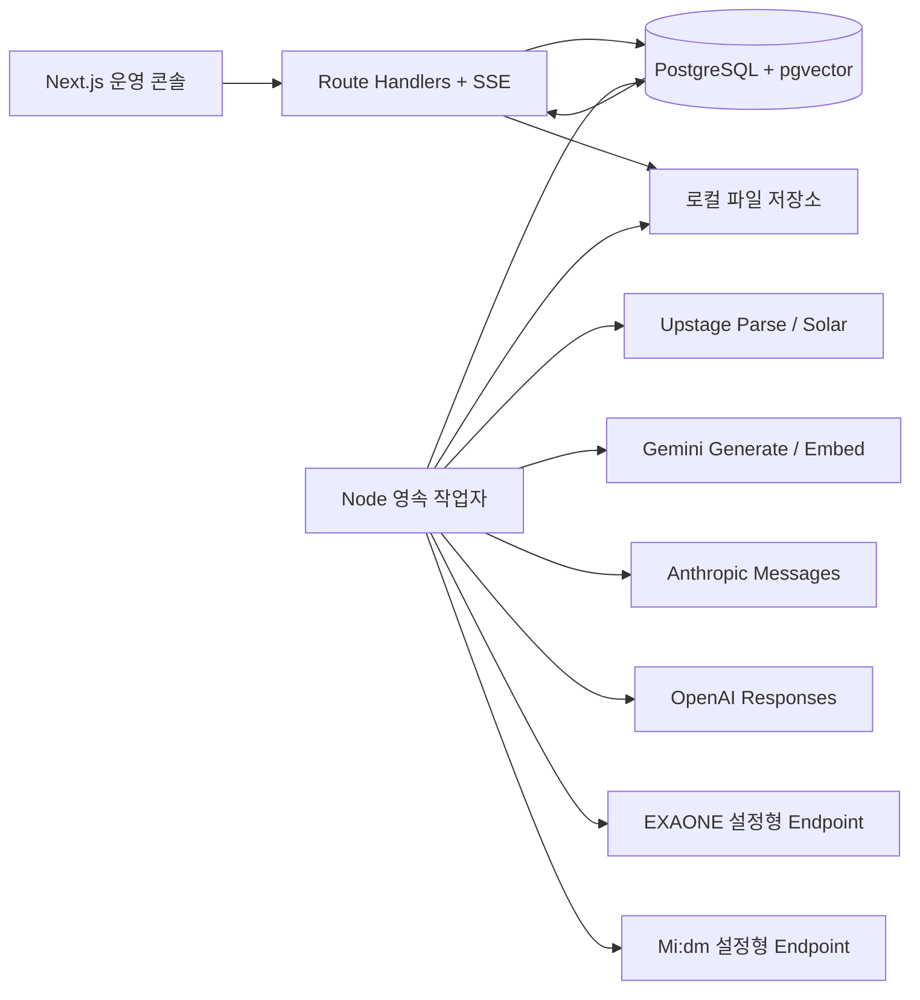

# EduBench 전체 시스템 설계

작성일: 2026-07-20  
상태: 자체 검수 완료, 구현 승인 대기 생략(사용자 지시)  
Superdesign: [EduBench Enterprise Benchmark Console](https://superdesign.dev/teams/fd612140-5f43-4155-8c72-ca5e6883ef70/projects/fb454f99-e00c-4914-bed5-242a1eb54f05?live=1)

## 1. 설계 목표

EduBench는 국내 교과서에 기반한 교육용 AI 모델의 성능을 실제 API로 실행하고, 그 결과를 다른 프로젝트의 소개 자료에 사용할 수 있는 객관적 근거로 만드는 로컬 운영 시스템이다. 시연용 화면이나 EXAONE 우승을 전제로 한 도구가 아니라, 문항 근거·실행 조건·채점 버전·통계적 불확실성을 모두 추적하는 재현 가능한 벤치마크 운영체계다.

초기 공식 데이터셋은 500문항이며 역량 분포는 핵심 개념 150, 개념 적용·문제풀이 120, 여러 단원 연결 80, 학생 수준별 설명 80, 오개념 교정 70으로 고정한다. 측정 모드는 근거 제공형 400, 폐쇄형 75, 근거 부족 판단형 25를 기본 프로필로 사용한다. 문항 형식은 객관식 100, 단답형 100, 구조화 서술형 200, 학생 설명형 60, 교정·범위 판단형 40을 목표로 한다.

## 2. 선택한 구현 접근

### 채택안: TypeScript 단일 언어 + PostgreSQL 영속 큐

- Next.js App Router가 UI와 HTTP/SSE API를 제공한다.
- 별도 Node.js 작업자가 같은 도메인 패키지와 DB를 사용해 문서 처리, 문항 생성, 모델 실행, 채점을 수행한다.
- PostgreSQL이 업무 데이터, 이벤트, 감사 기록, 큐를 모두 보관하고 pgvector가 교과서 청크 임베딩을 저장한다.
- 작업 선점은 `FOR UPDATE SKIP LOCKED`, lease 만료, idempotency key로 구현한다.
- Docker Compose는 `db`, `web`, `worker` 세 서비스를 실행한다.

이 접근은 Python/Celery/Redis를 추가하는 방식보다 운영 요소가 적고, 웹·작업자 간 타입과 검증 로직을 공유할 수 있다. Django 단일 서버보다 실시간 콘솔과 고밀도 분석 UI를 구현하기 쉽다.

## 3. 논리 아키텍처

웹 요청은 장시간 외부 API 작업을 직접 기다리지 않는다. API는 검증된 명령과 작업 레코드를 한 트랜잭션에서 만들고 즉시 반환한다. 작업자는 큐를 선점하고 단계별 결과와 이벤트를 저장한다. UI는 SSE를 통해 이벤트를 받고, 연결이 끊기면 마지막 이벤트 ID 이후부터 재연결한다.

## 4. 주요 모듈

### 웹 애플리케이션

- 공통 앱 셸, 좌측 내비게이션, 상단 컨텍스트 바
- 운영 현황, 자료, 생성, 검수, 데이터셋, 실행, 결과, 설정 페이지
- Route Handler 기반 JSON API와 SSE
- URL 기반 필터, 서버 측 페이지네이션, 작업 상태 폴링 대체용 SSE
- 서버 액션에 의존하지 않는 명시적 API 계약

### 작업자

- `document.parse`: Upstage Document Parse 호출 및 HTML 저장
- `document.chunk`: 구조 보존 청크 생성
- `document.embed`: Gemini 임베딩 생성 및 pgvector 저장
- `question.generate`: 9단계 생성 파이프라인
- `benchmark.execute`: 모델별 개별 호출, 정규화, 비용 기록
- `response.score`: 규칙·심판 모델·사람 재정의가 공존하는 버전형 채점
- `report.export`: CSV, JSON, PDF 보고서 생성

### 공급자 어댑터

공통 인터페이스는 `generate(request): Promise<NormalizedGeneration>`과 `embed(request): Promise<NormalizedEmbedding>`이다. Google, Anthropic, OpenAI는 네이티브 규격을 사용한다. Upstage, EXAONE, Mi:dm은 OpenAI 호환 또는 환경변수로 지정한 프로토콜을 사용하며, 계약 API 차이는 어댑터 내부에만 둔다.

공통 응답은 원문, 정규화 텍스트, finish reason, 입력·출력 토큰, 지연시간, provider request ID, 모델 ID, 모델 snapshot, 재시도 이력, 오류 분류를 포함한다. 비밀키는 `.env`에서만 읽고 DB·로그·UI에 저장하지 않는다.

## 5. 핵심 데이터 모델

- `source_files`: 원본 파일, 과목·학년, 저장 경로, 전체 처리 상태
- `source_revisions`: Parse 버전, HTML 원문·수정본, 수정 이력
- `source_chunks`: 단원·페이지·문단·표·예제 메타데이터, 내용, 벡터
- `generation_batches`: 생성 조건과 모델·프롬프트 버전
- `questions`: 작업본 문항과 현재 검수 상태
- `question_evidence`: 문항과 근거 청크의 순서·역할·인용
- `question_revisions`: 질문·정답·원자 채점 기준 변경 이력
- `review_actions`: 승인·보류·삭제·재생성 감사 기록
- `dataset_versions`: 불변 버전, 문항 목록 해시, 분포, 확정 시각
- `benchmark_runs`: 실행 프로필과 상태 머신
- `run_models`: 공급자별 모델·파라미터·동시성·비용 프로필
- `run_items`: 문항×모델 단위 상태, attempt, lease, idempotency key
- `model_responses`: 원문·정규화 응답, 토큰, 지연시간, 비용, 오류
- `score_profiles`: 지표·rubric·심판 프롬프트·가중치 버전
- `scores`: claim/rubric/metric 단위 점수와 판정 근거
- `human_scores`: 블라인드 사람 채점과 override
- `job_events`: SSE와 감사용 append-only 이벤트
- `price_profiles`: 공급자·모델별 입력/출력 가격과 유효 시점
- `report_artifacts`: 보고서 종류, 입력 실행, 파일 경로, 해시

삭제는 감사 추적이 필요한 객체에 대해 soft delete를 사용한다. 데이터셋 버전, 실행 프로필, 원응답, 채점 결과는 생성 후 덮어쓰지 않고 새 버전이나 override로 추가한다.

## 6. 상태 머신

문서 단계는 `UPLOADED → PARSING → PARSED → HTML_REVIEWED → CHUNKING → CHUNKED → EMBEDDING → READY`이며 각 실행 단계에서 `FAILED`로 이동할 수 있다. 실패한 단계부터 재시도하고 앞 단계 산출물은 보존한다.

문항은 `DRAFT → IN_REVIEW → APPROVED | HELD | DELETED`로 이동한다. 수정 후 승인은 새 revision을 만든 뒤 승인한다.

벤치마크 실행은 `DRAFT → QUEUED → RUNNING ↔ PAUSED → SCORING → COMPLETED`를 기본으로 하며 `CANCELLING → CANCELLED`, `FAILED`가 있다. 일시 중지는 새 호출 선점만 막고 진행 중인 호출은 결과를 저장한 뒤 멈춘다. 취소는 대기 작업을 취소하고 진행 중 호출의 반환 결과는 `ignored_after_cancel`로 감사 저장한다.

`run_items`는 `PENDING → LEASED → SUCCEEDED | RETRY_WAIT | TERMINAL_FAILED | CANCELLED`로 동작한다. 작업자 종료로 lease가 만료되면 다른 작업자가 재선점한다. 성공 저장과 상태 전이는 하나의 DB 트랜잭션이다.

## 7. 문서와 문항 파이프라인

PDF 업로드 시 SHA-256으로 중복을 확인하고 로컬 볼륨에 원본을 저장한다. Upstage 결과는 원본 HTML과 검수 HTML을 분리한다. 청크는 제목 계층, 페이지, 문단, 표, 예제·문제 블록을 우선 경계로 사용하고, 너무 긴 블록만 토큰 기준으로 추가 분할한다.

문항 생성은 조건 분석, 복수 검색 질의, 선택 파일 한정 벡터 검색, 재정렬, 개념 구조화, 문항 설계, 질문·정답·rubric 생성, 근거 검증, 품질 평가 순서다. 모델의 숨은 추론은 저장하지 않고 설계 요약, 근거 요약, 검색 질의, 채택·배제 청크, 품질 점수만 구조화해 저장한다.

## 8. 공정한 실행과 채점

- 모든 모델은 동일한 확정 데이터셋 버전과 동일한 승인 근거 패킷을 받는다.
- 폐쇄형 문항은 근거 패킷을 제공하지 않는다.
- 근거 부족 문항은 불충분함을 식별하고 과도한 단정을 피하는지를 평가한다.
- 모델별 실시간 검색은 기본 벤치마크에서 금지해 검색 품질과 모델 품질의 혼입을 막는다.
- 공통 시스템 지시, 최대 출력 길이, 온도 0 또는 공급자 최저 결정성 설정을 사용하고 예외를 실행 프로필에 기록한다.
- 모델명은 심판과 사람 채점에서 블라인드 식별자로 치환한다.
- 객관식 정답 위치는 A–D 균형을 강제한다.

객관식은 exact match, 단답형은 정규화·허용 답 목록, 서술형은 원자 rubric으로 채점한다. 근거성은 답변을 claim 단위로 분해해 supported, contradicted, unsupported를 판정한다. 완전성, 교육과정 정합성, 학년 적합성, 오개념, 환각, 범위 이탈을 별도 지표로 저장한다.

LLM 심판은 블라인드 절대평가가 기본이다. 쌍대 비교는 보조 분석에서만 사용하고 순서를 뒤집어 위치 편향을 확인한다. 공식 실행의 10–20%를 이중 블라인드 사람 채점 표본으로 검증하고 심판-사람 일치도를 보고한다.

## 9. 통계와 결과 표현

주요 결과는 모델별 평균, 문항 수 `n`, 실패 수, 표준오차, paired bootstrap 95% 신뢰구간을 포함한다. 이진 정답 비교에는 McNemar 검정을 보조로 제공한다. 다중 비교를 공개할 때는 Holm 보정을 선택할 수 있다.

단일 종합점수는 기본 결론으로 사용하지 않는다. 결과 분석의 첫 화면은 지표 행렬이며 과목, 학년, 단원, 목적, 난이도, 형식, 측정 모드로 층화한다. 비용·지연시간·실패율도 정확성 지표와 함께 표시한다. 가중 종합점수는 별도 버전형 프로필로만 제공하고 가중치 민감도 분석을 함께 노출한다.

EXAONE은 기본 비교 기준으로 선택할 수 있지만 색상, 정렬, 문구로 우대하지 않는다. 강점과 약점, 신뢰구간 중첩, 표본 부족을 동일 기준으로 기술한다.

## 10. 화면 설계

Superdesign에서 8개 화면을 작성했다. 고정 232px 사이드바, 56px 상단 바, 흰색·쿨그레이·코발트 블루, 얇은 경계선, 6px 반경, 그림자 최소화가 공통 규칙이다.

- `/dashboard`: 운영 현황, 실행 진행, 준비도, 조치 항목
- `/sources`: 업로드·문서 처리 단계·재시도·HTML/청크 검사
- `/generation`: 조건 설정과 9단계 생성 파이프라인
- `/review`: 큐, 편집, rubric, 교과서 근거를 동시에 보는 검수 콘솔
- `/datasets`: 500문항 분포, 불균형 경고, 불변 버전
- `/runs/[id]`: 중단·재개 가능한 3,000호출 실행 컨트롤러
- `/results`: 다차원 지표, 층화, 쌍대 비교, 응답 드릴다운
- `/settings`: 모델 ID·base URL·재시도·가격·채점 프로필

API 키 표시나 연결 확인 기능, 사용자 프로필, 권한 관리는 없다.

## 11. 오류 처리와 복구

공급자 오류는 `AUTH`, `RATE_LIMIT`, `TIMEOUT`, `NETWORK`, `INVALID_REQUEST`, `CONTENT_FILTER`, `PROVIDER_5XX`, `PARSE`, `UNKNOWN`으로 정규화한다. 인증·잘못된 요청은 자동 재시도하지 않는다. 429, timeout, network, 5xx는 `Retry-After`를 우선하고 지수 backoff + jitter로 제한 횟수만 재시도한다.

모든 작업은 idempotency key를 갖는다. 동일 요청 재제출 시 기존 작업을 반환한다. 파일·DB 저장은 임시 파일 또는 트랜잭션을 사용하며 부분 성공을 완료로 표시하지 않는다. UI는 실패 단계, 공급자 request ID, 시도 횟수, 다음 재시도 시각, 사용자가 가능한 조치를 보여준다.

## 12. 테스트 전략

- Vitest 단위 테스트: 상태 머신, 분포 검증, 점수 정규화, 비용 계산, 재시도, 어댑터 변환
- PostgreSQL 통합 테스트: migration, queue 선점/lease, idempotency, dataset 불변성
- Mock HTTP 통합 테스트: 여섯 공급자 성공·오류·rate-limit 응답
- Playwright E2E: 파일 업로드에서 결과 분석까지 핵심 흐름, pause/resume, 실패 재실행, 내보내기
- 접근성: axe 기반 주요 페이지 검사
- Docker smoke: 깨끗한 볼륨에서 migrate, seed, web/worker health, 브라우저 핵심 경로

실제 공급자 호출은 키가 존재할 때만 실행하는 별도 smoke 명령으로 두고 기본 CI 테스트에서는 mock 서버를 사용한다. 사용자가 요청하지 않은 연결 확인 UI는 만들지 않는다.

## 13. 자체 설계 검수 결과

- 요구된 여섯 업무 페이지와 운영 현황·설정 화면이 모두 설계에 포함됨
- 결과 분석을 가장 상세한 화면과 데이터 모델로 배정함
- 혼합 측정 모드와 정확한 500문항 역량 분포를 설계 문서에 고정함
- 특정 모델 우대 표현과 단일 점수 중심 표현을 제거함
- 구형 샘플 모델명은 구현에서 `.env` 모델 ID를 표시하도록 변경함
- 2024년 샘플 날짜는 구현 seed에서 현재 프로젝트 기준의 명시적 샘플임을 표시하거나 제거함
- API 키 연결 확인, 인증, 역할, 권한 기능이 포함되지 않았음을 확인함
- 서버 재시작, 페이지 새로고침, 중복 명령, lease 만료 복구 경로를 정의함
- 원응답·버전·실패 행을 보존해 소개 자료의 근거 추적성을 확보함

## 14. 구현 완료 조건

Docker Compose 한 명령으로 DB·웹·작업자가 실행되고, 실제 `.env` 키가 있을 때 문서 파싱·임베딩·모델 실행이 가능해야 한다. 키가 없어도 seed 데이터와 mock provider 모드로 전체 운영 흐름과 테스트를 재현할 수 있어야 한다. 모든 주요 페이지는 DB 데이터로 동작하며 새로고침 후 상태가 유지되어야 한다. 전체 자동 테스트, 타입 검사, lint, production build, Docker health check가 통과해야 완료로 간주한다.
